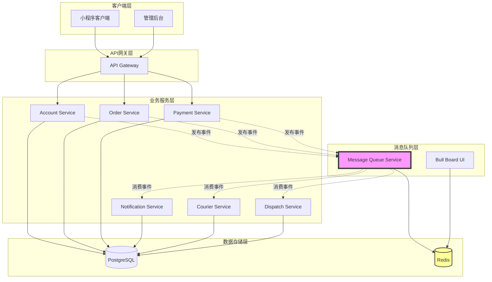
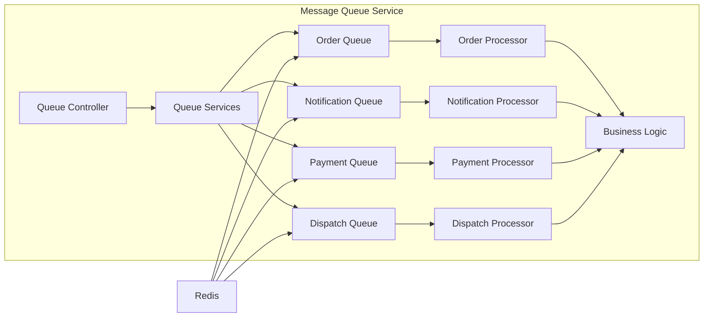

# 消息中间件集成设计文档

## 概述

本文档详细描述OneRecycle系统引入消息中间件的技术选型、架构设计和实现方案。通过引入消息队列，系统将从同步调用模式转变为事件驱动的异步架构，显著提升高可用性和可扩展性。

## 技术选型分析

### 候选方案对比

| 维度 | RabbitMQ | Apache Kafka | Redis + Bull Queue |
|------|----------|--------------|-------------------|
| **部署复杂度** | 中等（需要Erlang环境） | 高（需要Zookeeper/KRaft） | 低（项目已有Redis） |
| **学习曲线** | 中等 | 陡峭 | 平缓 |
| **消息吞吐量** | 中等（万级/秒） | 高（十万级/秒） | 中等（万级/秒） |
| **消息持久化** | 支持 | 支持 | 支持（Redis AOF/RDB） |
| **延迟队列** | 原生支持 | 不支持 | 原生支持 |
| **优先级队列** | 支持 | 不支持 | 支持 |
| **任务重试** | 需要自己实现 | 需要自己实现 | 原生支持 |
| **监控UI** | 自带管理界面 | 需要第三方工具 | Bull Board |
| **NestJS集成** | @nestjs/microservices | @nestjs/microservices | @nestjs/bull |
| **TypeScript支持** | 良好 | 良好 | 优秀 |
| **运维成本** | 中等 | 高 | 低 |
| **适用场景** | 通用消息队列 | 大数据流处理 | 任务队列、延迟任务 |

### 选型决策：Redis + Bull Queue

**选择理由：**

1. **低部署成本**：项目已规划使用Redis作为缓存，无需额外部署新的中间件
2. **学习曲线平缓**：团队熟悉Redis，Bull Queue API简单直观
3. **功能完备**：原生支持延迟队列、优先级、重试、速率限制等核心功能
4. **NestJS深度集成**：@nestjs/bull提供装饰器和依赖注入支持
5. **监控友好**：Bull Board提供开箱即用的Web管理界面
6. **TypeScript优先**：完整的类型定义和类型安全
7. **满足业务需求**：当前业务规模（订单、通知、支付）不需要Kafka级别的吞吐量

**权衡说明：**
- 如果未来需要处理大规模日志流、实时分析等场景，可以考虑引入Kafka作为补充
- Redis单点故障可通过Redis Sentinel或Redis Cluster解决

## 架构设计

### 整体架构图



### 消息队列服务架构



## 组件设计

### 1. 消息队列服务 (Message Queue Service)

#### 目录结构
```
services/message-queue/
├── src/
│   ├── queue/
│   │   ├── services/              # 队列服务（生产者）
│   │   │   ├── order-queue.service.ts
│   │   │   ├── notification-queue.service.ts
│   │   │   ├── payment-queue.service.ts
│   │   │   └── dispatch-queue.service.ts
│   │   ├── processors/            # 消息处理器（消费者）
│   │   │   ├── order.processor.ts
│   │   │   ├── notification.processor.ts
│   │   │   ├── payment.processor.ts
│   │   │   └── dispatch.processor.ts
│   │   ├── dto/                   # 数据传输对象
│   │   │   ├── order-events.dto.ts
│   │   │   ├── notification-events.dto.ts
│   │   │   └── payment-events.dto.ts
│   │   ├── queue.controller.ts    # 队列管理API
│   │   └── queue.module.ts
│   ├── health/                    # 健康检查
│   │   ├── health.controller.ts
│   │   └── health.module.ts
│   ├── config/                    # 配置
│   │   └── queue.config.ts
│   ├── app.module.ts
│   └── main.ts
├── .env.example
├── Dockerfile
├── package.json
└── tsconfig.json
```

#### 核心接口定义

```typescript
// 队列配置接口
interface QueueConfig {
  name: string;
  redis: RedisConfig;
  defaultJobOptions: JobOptions;
}

// 任务选项
interface JobOptions {
  priority?: number;        // 优先级 (1-10)
  delay?: number;          // 延迟时间（毫秒）
  attempts?: number;       // 重试次数
  backoff?: BackoffOptions; // 退避策略
  removeOnComplete?: boolean;
  removeOnFail?: boolean;
}

// 退避策略
interface BackoffOptions {
  type: 'fixed' | 'exponential';
  delay: number;
}
```

### 2. 队列定义

#### 订单队列 (Order Queue)

**队列名称**: `order-queue`

**任务类型**:
- `order-created`: 订单创建
- `order-status-changed`: 订单状态变更
- `order-cancelled`: 订单取消
- `dispatch-order`: 派单任务

**配置**:
```typescript
{
  priority: 10,
  attempts: 3,
  backoff: {
    type: 'exponential',
    delay: 2000
  }
}
```

#### 通知队列 (Notification Queue)

**队列名称**: `notification-queue`

**任务类型**:
- `send-sms`: 发送短信
- `send-push`: 发送推送通知
- `send-email`: 发送邮件
- `batch-notification`: 批量通知

**配置**:
```typescript
{
  priority: 8,
  attempts: 3,
  backoff: {
    type: 'fixed',
    delay: 5000
  },
  limiter: {
    max: 100,      // 每分钟最多100条
    duration: 60000
  }
}
```

#### 支付队列 (Payment Queue)

**队列名称**: `payment-queue`

**任务类型**:
- `process-payment-callback`: 处理支付回调
- `payment-success`: 支付成功处理
- `payment-failed`: 支付失败处理
- `refund-process`: 退款处理

**配置**:
```typescript
{
  priority: 10,
  attempts: 5,
  backoff: {
    type: 'exponential',
    delay: 1000
  }
}
```

#### 派单队列 (Dispatch Queue)

**队列名称**: `dispatch-queue`

**任务类型**:
- `auto-dispatch`: 自动派单
- `manual-dispatch`: 手动派单
- `reassign-courier`: 重新分配快递员

**配置**:
```typescript
{
  priority: 9,
  attempts: 3,
  delay: 300000  // 默认延迟5分钟
}
```

### 3. 事件定义

#### 订单事件

```typescript
// 订单创建事件
interface OrderCreatedEvent {
  orderId: string;
  userId: string;
  items: OrderItem[];
  address: Address;
  scheduledTime: string;
  totalAmount: number;
  createdAt: string;
}

// 订单状态变更事件
interface OrderStatusChangedEvent {
  orderId: string;
  oldStatus: OrderStatus;
  newStatus: OrderStatus;
  updatedBy: string;
  reason?: string;
  timestamp: string;
}

// 订单取消事件
interface OrderCancelledEvent {
  orderId: string;
  userId: string;
  reason: string;
  cancelledBy: string;
  timestamp: string;
}
```

#### 通知事件

```typescript
// 短信通知事件
interface SmsNotificationEvent {
  phone: string;
  template: string;
  params: Record<string, any>;
  priority: 'high' | 'normal' | 'low';
}

// 推送通知事件
interface PushNotificationEvent {
  userId: string;
  title: string;
  content: string;
  data?: Record<string, any>;
  priority: 'high' | 'normal' | 'low';
}
```

#### 支付事件

```typescript
// 支付回调事件
interface PaymentCallbackEvent {
  transactionId: string;
  orderId: string;
  amount: number;
  status: 'success' | 'failed';
  provider: 'wechat' | 'alipay';
  rawData: any;
  timestamp: string;
}
```

## 数据模型

### 任务状态表 (job_status)

用于追踪任务执行状态和实现幂等性。

```sql
CREATE TABLE job_status (
  id UUID PRIMARY KEY DEFAULT gen_random_uuid(),
  job_id VARCHAR(255) UNIQUE NOT NULL,
  job_type VARCHAR(100) NOT NULL,
  queue_name VARCHAR(100) NOT NULL,
  status VARCHAR(50) NOT NULL, -- pending, processing, completed, failed
  payload JSONB NOT NULL,
  result JSONB,
  error_message TEXT,
  attempts INTEGER DEFAULT 0,
  max_attempts INTEGER DEFAULT 3,
  created_at TIMESTAMP DEFAULT NOW(),
  updated_at TIMESTAMP DEFAULT NOW(),
  completed_at TIMESTAMP,
  INDEX idx_job_id (job_id),
  INDEX idx_status (status),
  INDEX idx_created_at (created_at)
);
```

### 死信队列表 (dead_letter_queue)

存储多次失败的任务。

```sql
CREATE TABLE dead_letter_queue (
  id UUID PRIMARY KEY DEFAULT gen_random_uuid(),
  job_id VARCHAR(255) NOT NULL,
  queue_name VARCHAR(100) NOT NULL,
  job_type VARCHAR(100) NOT NULL,
  payload JSONB NOT NULL,
  error_message TEXT,
  failed_attempts INTEGER,
  last_error TEXT,
  created_at TIMESTAMP DEFAULT NOW(),
  resolved BOOLEAN DEFAULT FALSE,
  resolved_at TIMESTAMP,
  INDEX idx_queue_name (queue_name),
  INDEX idx_resolved (resolved)
);
```

## 错误处理策略

### 重试策略

```typescript
const retryStrategy = {
  // 指数退避
  exponential: {
    attempts: 3,
    backoff: {
      type: 'exponential',
      delay: 2000  // 2s, 4s, 8s
    }
  },
  
  // 固定延迟
  fixed: {
    attempts: 3,
    backoff: {
      type: 'fixed',
      delay: 5000  // 每次5秒
    }
  }
};
```

### 死信队列处理

1. **自动移入**: 任务失败次数超过最大重试次数后自动移入DLQ
2. **告警通知**: DLQ有新任务时发送告警通知管理员
3. **手动重试**: 管理员可通过UI手动重试DLQ中的任务
4. **定期清理**: 超过30天的已解决任务自动归档

### 幂等性保证

```typescript
// 使用唯一ID确保幂等性
async function processWithIdempotency(jobId: string, handler: Function) {
  // 检查是否已处理
  const existing = await jobStatusRepo.findByJobId(jobId);
  if (existing && existing.status === 'completed') {
    return existing.result;
  }
  
  // 标记为处理中
  await jobStatusRepo.updateStatus(jobId, 'processing');
  
  try {
    const result = await handler();
    await jobStatusRepo.updateStatus(jobId, 'completed', result);
    return result;
  } catch (error) {
    await jobStatusRepo.updateStatus(jobId, 'failed', null, error.message);
    throw error;
  }
}
```

## 监控和管理

### Bull Board集成

Bull Board提供Web UI用于监控和管理队列。

**功能**:
- 实时查看队列状态（等待、处理中、完成、失败）
- 查看任务详情和日志
- 手动重试失败任务
- 清理已完成任务
- 暂停/恢复队列

**访问地址**: `http://localhost:3010/admin/queues`

### 监控指标

```typescript
interface QueueMetrics {
  queueName: string;
  waiting: number;      // 等待中的任务数
  active: number;       // 处理中的任务数
  completed: number;    // 已完成的任务数
  failed: number;       // 失败的任务数
  delayed: number;      // 延迟任务数
  paused: boolean;      // 是否暂停
}
```

### 告警规则

1. **队列积压告警**: 等待任务数 > 1000
2. **失败率告警**: 失败率 > 5%
3. **处理延迟告警**: P95延迟 > 10秒
4. **死信队列告警**: DLQ有新任务

## 部署配置

### Docker Compose配置

```yaml
services:
  redis:
    image: redis:7-alpine
    container_name: one-recycle-redis
    ports:
      - "6379:6379"
    volumes:
      - redis_data:/data
    command: redis-server --appendonly yes
    
  message-queue:
    build:
      context: ./services/message-queue
    container_name: one-recycle-message-queue
    ports:
      - "3010:3010"
    environment:
      - REDIS_HOST=redis
      - REDIS_PORT=6379
      - NODE_ENV=development
    depends_on:
      - redis
```

### 环境变量

```bash
# Redis配置
REDIS_HOST=localhost
REDIS_PORT=6379
REDIS_PASSWORD=
REDIS_DB=0

# 服务配置
PORT=3010
NODE_ENV=development

# 队列配置
QUEUE_REMOVE_ON_COMPLETE=100
QUEUE_REMOVE_ON_FAIL=1000

# Bull Board配置
BULL_BOARD_ENABLED=true
BULL_BOARD_PATH=/admin/queues
```

## 性能优化

### 1. 并发处理

```typescript
// 配置并发处理器数量
@Processor('order-queue', {
  concurrency: 5  // 同时处理5个任务
})
```

### 2. 批量处理

```typescript
// 批量处理通知
async processBatchNotifications(notifications: Notification[]) {
  const chunks = _.chunk(notifications, 100);
  for (const chunk of chunks) {
    await Promise.all(chunk.map(n => this.sendNotification(n)));
  }
}
```

### 3. 速率限制

```typescript
// 限制处理速率
{
  limiter: {
    max: 100,        // 最大任务数
    duration: 60000  // 时间窗口（毫秒）
  }
}
```

## 安全考虑

1. **Redis认证**: 生产环境必须启用Redis密码认证
2. **网络隔离**: Redis和消息队列服务应在内网运行
3. **数据加密**: 敏感数据在入队前加密
4. **访问控制**: Bull Board UI应启用身份认证
5. **日志脱敏**: 日志中不应包含敏感信息

## 测试策略

### 单元测试

```typescript
describe('OrderQueueService', () => {
  it('should add order created event to queue', async () => {
    const event = createMockOrderCreatedEvent();
    await orderQueueService.handleOrderCreated(event);
    expect(mockQueue.add).toHaveBeenCalledWith('order-created', event);
  });
});
```

### 集成测试

```typescript
describe('Order Flow Integration', () => {
  it('should process order creation end-to-end', async () => {
    // 1. 创建订单
    const order = await orderService.create(orderDto);
    
    // 2. 等待队列处理
    await waitForQueueProcessing();
    
    // 3. 验证结果
    expect(notificationService.sendSms).toHaveBeenCalled();
    expect(dispatchService.assignCourier).toHaveBeenCalled();
  });
});
```

## 迁移计划

### 阶段1: 基础设施搭建（Week 1）
- 部署Redis服务
- 开发消息队列服务
- 集成Bull Board

### 阶段2: 核心流程改造（Week 2-3）
- 订单流程异步化
- 通知服务异步化
- 支付回调异步化

### 阶段3: 监控和优化（Week 4）
- 完善监控告警
- 性能测试和优化
- 文档完善

### 阶段4: 生产部署（Week 5）
- 灰度发布
- 生产环境验证
- 全量切换

## 回滚方案

如果消息队列出现问题，可以快速回滚到同步调用模式：

1. 通过配置开关禁用消息队列
2. 服务自动降级到直接调用模式
3. 修复问题后重新启用

```typescript
// 配置开关
const USE_MESSAGE_QUEUE = process.env.USE_MESSAGE_QUEUE === 'true';

if (USE_MESSAGE_QUEUE) {
  await queueService.handleOrderCreated(event);
} else {
  await this.processOrderDirectly(event);
}
```