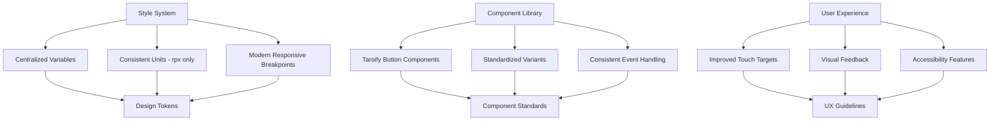

# Mini-Program Comprehensive Optimization Design

## Overview

This design document outlines a comprehensive optimization strategy for the OneRecycle mini-program to address styling inconsistencies, improve user experience, and standardize component usage across all supported platforms (WeChat, Alipay, TikTok, Kuaishou).

The optimization focuses on three core areas:
1. **Style System Standardization**: Unifying units, font sizes, and responsive breakpoints
2. **Component Library Integration**: Replacing custom View/Text buttons with Taroify components
3. **User Experience Enhancement**: Improving touch targets, visual feedback, and accessibility

## Architecture

### Current State Analysis

Based on codebase analysis, the following issues have been identified:

**Styling Issues:**
- Mixed unit usage: px, rpx, vh/vw units used inconsistently across 25+ SCSS files
- Font sizes too small: Base font sizes starting at 28rpx (14px) causing readability issues
- Outdated responsive breakpoints: Based on older device dimensions
- Excessive padding/margins: Reducing content area utilization

**Component Usage Issues:**
- 15+ instances of View/Text combinations used as buttons with onTap handlers
- Inconsistent interaction patterns across pages
- Missing accessibility features and proper semantic markup
- No standardized loading states or visual feedback

### Target Architecture



## Components and Interfaces

### 1. Style System Components

#### Variables System (variables.scss)
**Current State:**
```scss
$font-size-xs: 24rpx;      // 12px
$font-size-sm: 28rpx;      // 14px - Too small for mobile
$breakpoint-xs: 360px;     // Outdated breakpoint
```

**Target State:**
```scss
// Enhanced font scale for better readability
$font-size-xs: 26rpx;      // 13px - Minimum readable size
$font-size-sm: 30rpx;      // 15px - Improved readability
$font-size-base: 32rpx;    // 16px - Standard body text
$font-size-lg: 40rpx;      // 20px - Enhanced for buttons
$font-size-xl: 44rpx;      // 22px - Headings
$font-size-title: 56rpx;   // 28px - Page titles

// Modern responsive breakpoints
$breakpoint-xs: 375px;     // iPhone SE/12 mini
$breakpoint-sm: 390px;     // iPhone 12/13/14
$breakpoint-md: 430px;     // iPhone 12/13/14 Pro Max
$breakpoint-lg: 768px;     // iPad mini
$breakpoint-xl: 1024px;    // iPad Pro

// Standardized spacing scale
$spacing-xs: 8rpx;
$spacing-sm: 16rpx;
$spacing-base: 24rpx;
$spacing-lg: 32rpx;
$spacing-xl: 48rpx;
$spacing-xxl: 64rpx;

// Touch target standards
$touch-target-min: 88rpx;  // 44px minimum touch target
$button-height-sm: 64rpx;  // Small buttons
$button-height-md: 80rpx;  // Medium buttons  
$button-height-lg: 96rpx;  // Large buttons
```

#### Unit Conversion Strategy
**Conversion Rules:**
- `px` → `rpx`: Multiply by 2 (1px = 2rpx on standard screens)
- `vh/vw` → `rpx`: Replace with fixed rpx values or calc() expressions
- Maintain visual consistency during conversion

**Priority Files for Conversion:**
1. `app.scss` - Global styles with px units
2. `OfflineIndicator/index.scss` - Mixed px/rpx usage
3. All page SCSS files with vh/vw units (25+ files identified)

### 2. Component Library Integration

#### Button Component Standardization

**Taroify Button Variants:**
```typescript
interface ButtonStandardization {
  // Primary actions - most important user actions
  primary: {
    variant: 'contained',
    color: 'primary',
    size: 'large',
    usage: ['Submit forms', 'Confirm actions', 'Main CTAs']
  },
  
  // Secondary actions - supporting actions
  secondary: {
    variant: 'outlined',
    color: 'default',
    size: 'large', 
    usage: ['Cancel', 'Skip', 'Alternative actions']
  },
  
  // Auxiliary actions - minimal visual weight
  auxiliary: {
    variant: 'text',
    color: 'default',
    size: 'medium',
    usage: ['Links', 'Navigation', 'Subtle actions']
  },
  
  // Danger actions - destructive operations
  danger: {
    variant: 'contained',
    color: 'danger',
    size: 'large',
    usage: ['Delete', 'Remove', 'Destructive actions']
  }
}
```

#### Component Replacement Mapping

**High Priority Replacements:**
1. **Login Page** (`apps/client-mini/src/pages/login/index.tsx`)
   - Avatar container: `View onTap` → `Button variant="text"`
   - Agreement links: `View onTap` → `Button variant="text" size="small"`
   - Avatar picker options: `View onTap` → `Button variant="text" block`

2. **Agreement Page** (`apps/client-mini/src/pages/agreement/index.tsx`)
   - Back button: `View onTap` → `Button variant="text" icon={<Icon.ArrowLeft />}`

3. **Profile Pages** (Multiple files)
   - Menu items: `View onTap` → `Button variant="text" block`
   - Action buttons: `View onTap` → `Button variant="outlined"`

**Component Interface:**
```typescript
interface ButtonReplacementPattern {
  // Before
  old: {
    element: 'View',
    event: 'onTap',
    styling: 'Custom CSS classes'
  },
  
  // After  
  new: {
    element: 'Button',
    event: 'onClick',
    props: {
      variant: 'contained' | 'outlined' | 'text',
      size: 'large' | 'medium' | 'small',
      color: 'primary' | 'default' | 'danger',
      block?: boolean,
      disabled?: boolean,
      loading?: boolean
    }
  }
}
```

### 3. Responsive Layout System

#### Breakpoint Strategy
```scss
// Mobile-first responsive mixins
@mixin mobile-small {
  @media (max-width: #{$breakpoint-xs - 1}) {
    @content;
  }
}

@mixin mobile-standard {
  @media (min-width: #{$breakpoint-xs}) and (max-width: #{$breakpoint-sm - 1}) {
    @content;
  }
}

@mixin mobile-large {
  @media (min-width: #{$breakpoint-sm}) and (max-width: #{$breakpoint-md - 1}) {
    @content;
  }
}

@mixin tablet {
  @media (min-width: #{$breakpoint-lg}) {
    @content;
  }
}
```

#### Layout Optimization
**Container Standards:**
```scss
.page-container {
  padding: 0 $spacing-base;
  min-height: 100vh; // Keep vh for full height
  background: $bg-secondary;
  
  // Reduce excessive padding
  &.compact {
    padding: 0 $spacing-sm;
  }
}

.content-section {
  margin-bottom: $spacing-lg;
  padding: $spacing-base;
  
  // Optimize for content density
  &.dense {
    padding: $spacing-sm;
    margin-bottom: $spacing-base;
  }
}
```

## Data Models

### Style Configuration Model
```typescript
interface StyleConfiguration {
  units: {
    primary: 'rpx',
    fallback: 'px',
    prohibited: ['vh', 'vw'] // Except for full-height containers
  },
  
  typography: {
    scale: 'enhanced', // Larger font sizes for mobile
    minSize: 26, // rpx
    maxSize: 64, // rpx
    lineHeight: 1.4
  },
  
  spacing: {
    scale: 'consistent',
    base: 24, // rpx
    multiplier: [0.33, 0.67, 1, 1.33, 2, 2.67] // xs, sm, base, lg, xl, xxl
  },
  
  touchTargets: {
    minimum: 88, // rpx (44px)
    recommended: 96, // rpx (48px)
    comfortable: 104 // rpx (52px)
  }
}
```

### Component Usage Model
```typescript
interface ComponentUsagePattern {
  component: 'Button',
  variants: {
    contained: {
      usage: 'Primary actions',
      colors: ['primary', 'danger'],
      sizes: ['large', 'medium']
    },
    outlined: {
      usage: 'Secondary actions', 
      colors: ['default', 'primary'],
      sizes: ['large', 'medium']
    },
    text: {
      usage: 'Auxiliary actions',
      colors: ['default', 'primary'],
      sizes: ['medium', 'small']
    }
  },
  
  accessibility: {
    minTouchTarget: 88, // rpx
    semanticMarkup: true,
    keyboardNavigation: true,
    screenReader: true
  }
}
```

## Error Handling

### Style Migration Errors
```typescript
interface StyleMigrationError {
  type: 'unit-conversion' | 'breakpoint-mismatch' | 'layout-break',
  file: string,
  line: number,
  original: string,
  suggested: string,
  impact: 'low' | 'medium' | 'high'
}

// Error handling strategy
const handleStyleMigration = {
  unitConversion: {
    // Validate conversion ratios
    validatePxToRpx: (px: number) => px * 2,
    validateVhVwReplacement: (value: string) => {
      // Replace with appropriate rpx or calc() expression
      return value.includes('vh') ? 'min-height: 100vh' : `${parseInt(value) * 15}rpx`
    }
  },
  
  layoutValidation: {
    // Ensure layouts don't break during migration
    checkTouchTargets: (size: number) => size >= 88,
    validateReadability: (fontSize: number) => fontSize >= 26
  }
}
```

### Component Replacement Errors
```typescript
interface ComponentReplacementError {
  type: 'missing-props' | 'event-mismatch' | 'style-conflict',
  component: string,
  file: string,
  issue: string,
  resolution: string
}

// Component migration validation
const validateComponentReplacement = {
  eventHandlers: {
    // Ensure onTap → onClick migration
    validateEventMigration: (oldEvent: string, newEvent: string) => {
      return oldEvent === 'onTap' && newEvent === 'onClick'
    }
  },
  
  styleCompatibility: {
    // Ensure custom styles work with Taroify components
    checkStyleOverrides: (customStyles: string[]) => {
      const conflicts = ['border', 'background', 'padding']
      return customStyles.filter(style => 
        conflicts.some(conflict => style.includes(conflict))
      )
    }
  }
}
```

## Testing Strategy

### Visual Regression Testing
```typescript
interface VisualTestingStrategy {
  platforms: ['WeChat', 'Alipay', 'TikTok', 'Kuaishou'],
  devices: [
    { name: 'iPhone SE', width: 375, height: 667 },
    { name: 'iPhone 12', width: 390, height: 844 },
    { name: 'iPhone 12 Pro Max', width: 428, height: 926 },
    { name: 'Android Standard', width: 360, height: 640 }
  ],
  
  testCases: [
    'Font size readability across all screen sizes',
    'Touch target accessibility (minimum 44px)',
    'Button interaction states (normal, hover, active, disabled)',
    'Layout consistency across platforms',
    'Responsive breakpoint behavior'
  ]
}
```

### Component Integration Testing
```typescript
interface ComponentTestingStrategy {
  unitTests: [
    'Button variant rendering',
    'Event handler migration (onTap → onClick)',
    'Accessibility attributes',
    'Loading and disabled states'
  ],
  
  integrationTests: [
    'Page-level component interactions',
    'Form submission with new button components',
    'Navigation flow with updated touch targets',
    'Cross-platform component behavior'
  ],
  
  e2eTests: [
    'Complete user journey with optimized components',
    'Performance impact of style changes',
    'Platform-specific behavior validation'
  ]
}
```

### Performance Testing
```typescript
interface PerformanceTestingStrategy {
  metrics: [
    'Bundle size impact of Taroify component usage',
    'Render performance with new styling system',
    'Memory usage optimization',
    'Touch response time improvement'
  ],
  
  benchmarks: {
    bundleSize: 'No more than 5% increase',
    renderTime: 'Maintain or improve current performance',
    touchResponse: 'Sub-100ms response time',
    memoryUsage: 'No significant increase'
  }
}
```

## Implementation Phases

### Phase 1: Style System Foundation (Priority: High)
- Update `variables.scss` with enhanced font scale and modern breakpoints
- Convert global styles in `app.scss` from px to rpx
- Update spacing and sizing variables for consistency

### Phase 2: Component Library Integration (Priority: High)  
- Replace View/Text button combinations with Taroify Button components
- Implement standardized button variants and usage patterns
- Update event handlers from onTap to onClick

### Phase 3: Layout Optimization (Priority: Medium)
- Convert vh/vw units to rpx-based solutions where appropriate
- Optimize padding and margins for better content density
- Implement responsive layout improvements

### Phase 4: Testing and Validation (Priority: High)
- Visual regression testing across all platforms
- Component integration testing
- Performance impact assessment
- User acceptance testing

## Design Decisions and Rationales

### Font Size Enhancement
**Decision**: Increase minimum font size from 28rpx to 30rpx
**Rationale**: Improves readability on mobile devices, follows accessibility guidelines

### Touch Target Standardization  
**Decision**: Minimum 88rpx (44px) touch targets for all interactive elements
**Rationale**: Meets WCAG accessibility standards and improves user experience

### Component Library Adoption
**Decision**: Replace custom View/Text buttons with Taroify Button components
**Rationale**: Provides consistent interaction patterns, better accessibility, and reduced maintenance overhead

### Unit Standardization
**Decision**: Use rpx exclusively except for full-height containers (vh)
**Rationale**: Ensures consistent scaling across different screen densities and platforms

### Responsive Breakpoint Updates
**Decision**: Update breakpoints to reflect modern device dimensions
**Rationale**: Better adaptation to current smartphone and tablet screen sizes

This design provides a comprehensive foundation for optimizing the OneRecycle mini-program while maintaining cross-platform compatibility and improving user experience.