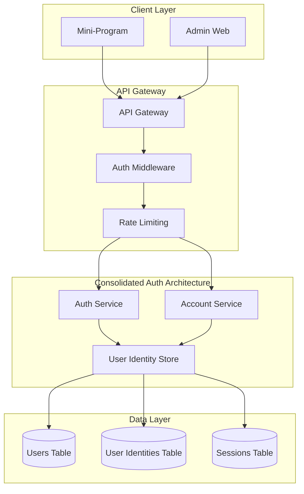
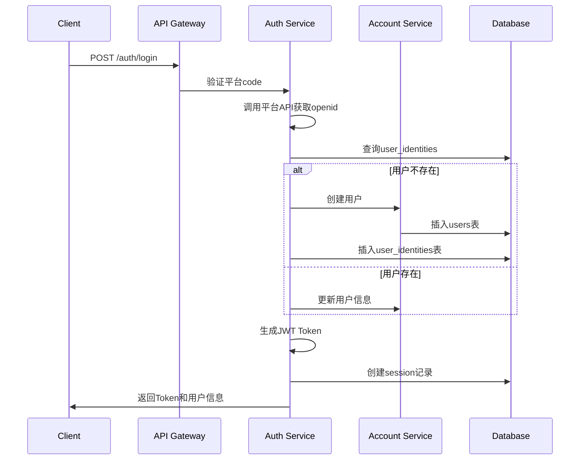

# OneRecycle Mini-Program Optimization Design Document

## Overview

本设计文档基于需求文档，详细阐述了OneRecycle多平台旧物回收小程序的优化设计方案。设计重点包括认证服务整合、UI/UX优化、性能提升和功能完善。

## Architecture

### 1. 认证服务整合架构



### 2. 服务职责重新划分

#### Auth Service (认证服务)
- **职责**: 用户认证、登录、Token管理
- **核心功能**:
  - 多平台登录（微信、支付宝、抖音、快手）
  - 验证码发送和验证
  - JWT Token生成和验证
  - 会话管理
  - 第三方平台身份绑定

#### Account Service (账户服务)
- **职责**: 用户资料管理、业务数据
- **核心功能**:
  - 用户基本信息管理
  - 地址管理
  - 用户状态管理
  - 用户查询和统计

### 3. 数据库设计优化

```sql
-- 用户表（简化，移除认证相关字段）
CREATE TABLE users (
    id BIGSERIAL PRIMARY KEY,
    mobile VARCHAR(11) UNIQUE,
    nickname VARCHAR(50),
    avatar_url TEXT,
    status VARCHAR(20) DEFAULT 'ACTIVE',
    created_at TIMESTAMP DEFAULT CURRENT_TIMESTAMP,
    updated_at TIMESTAMP DEFAULT CURRENT_TIMESTAMP
);

-- 用户身份表（支持多平台）
CREATE TABLE user_identities (
    id BIGSERIAL PRIMARY KEY,
    user_id BIGINT REFERENCES users(id),
    provider VARCHAR(20) NOT NULL, -- wechat, alipay, douyin, kuaishou
    openid VARCHAR(100) NOT NULL,
    unionid VARCHAR(100),
    platform_user_info JSONB,
    created_at TIMESTAMP DEFAULT CURRENT_TIMESTAMP,
    UNIQUE(provider, openid)
);

-- 会话表
CREATE TABLE user_sessions (
    id BIGSERIAL PRIMARY KEY,
    user_id BIGINT REFERENCES users(id),
    session_id VARCHAR(100) UNIQUE NOT NULL,
    device_fingerprint VARCHAR(200),
    expires_at TIMESTAMP NOT NULL,
    created_at TIMESTAMP DEFAULT CURRENT_TIMESTAMP
);
```

## Components and Interfaces

### 1. 登录页面优化设计

#### 问题分析
当前登录页面存在以下问题：
- 视图区域小，留白过多
- 组件间距过大
- 内容分布不均匀

#### 优化方案

**布局优化**:
```scss
.login-container {
  // 使用flex布局优化空间分配
  display: flex;
  flex-direction: column;
  min-height: 100vh;
}

.login-header {
  // 减少头部padding
  padding: 40px 32px 20px;
}

.main-content {
  // 使用居中对齐减少留白
  flex: 1;
  justify-content: center;
  padding: 0 32px 30px;
}
```

**组件间距优化**:
- 头像区域: margin-bottom: 24px → 20px
- 昵称输入: margin-bottom: 24px → 16px
- 授权说明: margin-bottom: 20px → 12px
- 操作按钮: margin-bottom: 20px → 16px

### 2. 统一认证流程设计



### 3. UI组件库设计

#### 按钮组件规范
```scss
// 主要按钮
.btn-primary {
  background: linear-gradient(135deg, #40e0d0 0%, #36d1c1 100%);
  border-radius: 26px;
  height: 48px;
  font-size: 16px;
  font-weight: 600;
  color: #ffffff;
  box-shadow: 0 4px 16px rgba(64, 224, 208, 0.3);
}

// 次要按钮
.btn-secondary {
  background: transparent;
  border: 1px solid #e6e6e6;
  border-radius: 24px;
  height: 44px;
  font-size: 16px;
  color: #666666;
}
```

#### 输入框组件规范
```scss
.form-input {
  width: 100%;
  height: 48px;
  background: #ffffff;
  border: 1px solid #e6e6e6;
  border-radius: 12px;
  padding: 0 16px;
  font-size: 16px;
  
  &:focus {
    border-color: #40e0d0;
    box-shadow: 0 0 0 3px rgba(64, 224, 208, 0.1);
  }
  
  &.error {
    border-color: #ff4757;
    box-shadow: 0 0 0 3px rgba(255, 71, 87, 0.1);
  }
}
```

### 4. 页面结构设计

#### 首页优化
```
┌─────────────────────────────────┐
│ Header (城市选择 + 搜索 + 用户)    │
├─────────────────────────────────┤
│ Banner轮播 (环保活动推广)         │
├─────────────────────────────────┤
│ 快速入口 (一键预约 + 价格查询)     │
├─────────────────────────────────┤
│ 回收分类网格 (10大品类)          │
├─────────────────────────────────┤
│ 推荐内容 (高价回收 + 环保资讯)     │
└─────────────────────────────────┘
```

#### 订单列表优化
```
┌─────────────────────────────────┐
│ Tab切换 (全部/待取件/进行中/已完成) │
├─────────────────────────────────┤
│ 订单卡片                        │
│ ┌─────────────────────────────┐ │
│ │ 状态标签 + 订单号            │ │
│ │ 物品信息 + 缩略图            │ │
│ │ 地址 + 时间                 │ │
│ │ 价格 + 操作按钮             │ │
│ └─────────────────────────────┘ │
└─────────────────────────────────┘
```

#### 个人中心优化
```
┌─────────────────────────────────┐
│ 用户信息卡片                     │
│ ┌─────────────────────────────┐ │
│ │ 头像 + 昵称 + 手机号         │ │
│ │ 积分余额 + 提现按钮          │ │
│ └─────────────────────────────┘ │
├─────────────────────────────────┤
│ 功能菜单                        │
│ • 我的订单                      │
│ • 地址管理                      │
│ • 交易记录                      │
│ • 提现记录                      │
│ • 设置                         │
└─────────────────────────────────┘
```

## Data Models

### 1. 用户认证数据模型

```typescript
// 用户基本信息
interface User {
  id: string;
  mobile?: string;
  nickname: string;
  avatarUrl?: string;
  status: 'ACTIVE' | 'INACTIVE' | 'BANNED';
  createdAt: string;
  updatedAt: string;
}

// 用户身份信息
interface UserIdentity {
  id: string;
  userId: string;
  provider: 'wechat' | 'alipay' | 'douyin' | 'kuaishou';
  openid: string;
  unionid?: string;
  platformUserInfo: Record<string, any>;
  createdAt: string;
}

// 登录请求
interface LoginRequest {
  code: string;
  provider: string;
  nickname?: string;
  avatarUrl?: string;
  deviceFingerprint?: string;
}

// 登录响应
interface LoginResponse {
  user: User;
  token: string;
  expiresIn: number;
  sessionId: string;
}
```

### 2. 业务数据模型

```typescript
// 回收订单
interface RecycleOrder {
  id: string;
  userId: string;
  items: OrderItem[];
  address: Address;
  scheduledTime: string;
  status: OrderStatus;
  totalAmount: number;
  createdAt: string;
  updatedAt: string;
}

// 订单物品
interface OrderItem {
  id: string;
  categoryId: string;
  name: string;
  description: string;
  images: string[];
  estimatedPrice: number;
  actualPrice?: number;
  weight?: number;
}

// 地址信息
interface Address {
  id: string;
  userId: string;
  name: string;
  phone: string;
  province: string;
  city: string;
  district: string;
  detail: string;
  isDefault: boolean;
}
```

## Error Handling

### 1. 认证错误处理

```typescript
enum AuthErrorCode {
  INVALID_CODE = 'INVALID_CODE',
  PLATFORM_ERROR = 'PLATFORM_ERROR',
  TOKEN_EXPIRED = 'TOKEN_EXPIRED',
  USER_BANNED = 'USER_BANNED',
  RATE_LIMITED = 'RATE_LIMITED'
}

interface AuthError {
  code: AuthErrorCode;
  message: string;
  details?: any;
}
```

### 2. 前端错误处理策略

```typescript
class ErrorHandler {
  static handle(error: any, options: { showToast?: boolean } = {}) {
    const { showToast = true } = options;
    
    // 网络错误
    if (error.code === 'NETWORK_ERROR') {
      if (showToast) {
        Taro.showToast({
          title: '网络连接失败',
          icon: 'error'
        });
      }
      return;
    }
    
    // 认证错误
    if (error.code === 'TOKEN_EXPIRED') {
      // 清除本地token，跳转登录页
      Taro.removeStorageSync('token');
      Taro.reLaunch({
        url: '/pages/login/index'
      });
      return;
    }
    
    // 业务错误
    if (showToast && error.message) {
      Taro.showToast({
        title: error.message,
        icon: 'error'
      });
    }
  }
}
```

## Testing Strategy

### 1. 单元测试

```typescript
// 认证服务测试
describe('AuthService', () => {
  it('should login with wechat code', async () => {
    const mockCode = 'test_code';
    const result = await authService.login({
      code: mockCode,
      provider: 'wechat'
    });
    
    expect(result.success).toBe(true);
    expect(result.data.token).toBeDefined();
  });
  
  it('should handle invalid code', async () => {
    const invalidCode = 'invalid_code';
    const result = await authService.login({
      code: invalidCode,
      provider: 'wechat'
    });
    
    expect(result.success).toBe(false);
    expect(result.error.code).toBe('INVALID_CODE');
  });
});
```

### 2. 集成测试

```typescript
// 登录流程集成测试
describe('Login Flow', () => {
  it('should complete full login process', async () => {
    // 1. 获取登录code
    const loginResult = await Taro.login();
    expect(loginResult.code).toBeDefined();
    
    // 2. 调用登录API
    const authResult = await login({
      code: loginResult.code,
      provider: 'wechat',
      nickname: 'Test User'
    });
    
    expect(authResult.success).toBe(true);
    expect(authResult.data.token).toBeDefined();
    
    // 3. 验证token存储
    const storedToken = Taro.getStorageSync('token');
    expect(storedToken).toBe(authResult.data.token);
  });
});
```

### 3. E2E测试

```typescript
// 端到端测试场景
describe('E2E: User Journey', () => {
  it('should complete recycling order flow', async () => {
    // 1. 登录
    await loginUser();
    
    // 2. 创建订单
    await createRecycleOrder();
    
    // 3. 查看订单列表
    await viewOrderList();
    
    // 4. 查看订单详情
    await viewOrderDetail();
  });
});
```

## Performance Optimization

### 1. 图片优化策略

```typescript
// 图片压缩和缓存
class ImageOptimizer {
  static async compressImage(filePath: string): Promise<string> {
    const result = await Taro.compressImage({
      src: filePath,
      quality: 80,
      compressedWidth: 800,
      compressedHeight: 800
    });
    
    return result.tempFilePath;
  }
  
  static async preloadImages(urls: string[]) {
    const promises = urls.map(url => 
      Taro.getImageInfo({ src: url }).catch(() => null)
    );
    
    await Promise.allSettled(promises);
  }
}
```

### 2. 请求优化

```typescript
// 请求缓存和防抖
class RequestOptimizer {
  private static cache = new Map();
  private static pendingRequests = new Map();
  
  static async cachedRequest(url: string, options: any = {}) {
    const cacheKey = `${url}_${JSON.stringify(options)}`;
    
    // 检查缓存
    if (this.cache.has(cacheKey)) {
      const cached = this.cache.get(cacheKey);
      if (Date.now() - cached.timestamp < 5 * 60 * 1000) { // 5分钟缓存
        return cached.data;
      }
    }
    
    // 检查是否有相同请求正在进行
    if (this.pendingRequests.has(cacheKey)) {
      return this.pendingRequests.get(cacheKey);
    }
    
    // 发起新请求
    const promise = request(url, options);
    this.pendingRequests.set(cacheKey, promise);
    
    try {
      const result = await promise;
      this.cache.set(cacheKey, {
        data: result,
        timestamp: Date.now()
      });
      return result;
    } finally {
      this.pendingRequests.delete(cacheKey);
    }
  }
}
```

### 3. 页面性能优化

```typescript
// 虚拟列表实现
const VirtualList: React.FC<{
  items: any[];
  itemHeight: number;
  renderItem: (item: any, index: number) => React.ReactNode;
}> = ({ items, itemHeight, renderItem }) => {
  const [scrollTop, setScrollTop] = useState(0);
  const [viewHeight, setViewHeight] = useState(0);
  
  const startIndex = Math.floor(scrollTop / itemHeight);
  const endIndex = Math.min(
    startIndex + Math.ceil(viewHeight / itemHeight) + 1,
    items.length
  );
  
  const visibleItems = items.slice(startIndex, endIndex);
  
  return (
    <ScrollView
      scrollY
      style={{ height: viewHeight }}
      scrollTop={scrollTop}
      onScroll={(e) => setScrollTop(e.detail.scrollTop)}
    >
      <View style={{ height: items.length * itemHeight, position: 'relative' }}>
        {visibleItems.map((item, index) => (
          <View
            key={startIndex + index}
            style={{
              position: 'absolute',
              top: (startIndex + index) * itemHeight,
              height: itemHeight,
              width: '100%'
            }}
          >
            {renderItem(item, startIndex + index)}
          </View>
        ))}
      </View>
    </ScrollView>
  );
};
```

## Security Considerations

### 1. 认证安全

```typescript
// JWT Token安全配置
const jwtConfig = {
  secret: process.env.JWT_SECRET, // 使用环境变量
  algorithm: 'HS256',
  expiresIn: '24h',
  issuer: 'onerecycle',
  audience: 'mini-program'
};

// Token验证中间件
export const authMiddleware = (req: Request, res: Response, next: NextFunction) => {
  const token = req.headers.authorization?.replace('Bearer ', '');
  
  if (!token) {
    return res.status(401).json({ error: 'Token required' });
  }
  
  try {
    const decoded = jwt.verify(token, jwtConfig.secret);
    req.user = decoded;
    next();
  } catch (error) {
    return res.status(401).json({ error: 'Invalid token' });
  }
};
```

### 2. 数据安全

```typescript
// 敏感数据加密
class DataSecurity {
  static encryptPhone(phone: string): string {
    // 手机号脱敏显示
    return phone.replace(/(\d{3})\d{4}(\d{4})/, '$1****$2');
  }
  
  static validateInput(input: string, type: 'phone' | 'nickname'): boolean {
    const patterns = {
      phone: /^1[3-9]\d{9}$/,
      nickname: /^[\u4e00-\u9fa5a-zA-Z0-9_-]{2,20}$/
    };
    
    return patterns[type].test(input);
  }
}
```

## Deployment Strategy

### 1. 环境配置

```typescript
// 环境配置管理
const envConfig = {
  development: {
    API_BASE_URL: 'http://localhost:3002',
    LOG_LEVEL: 'debug',
    ENABLE_MOCK: true
  },
  production: {
    API_BASE_URL: 'https://api.onerecycle.com',
    LOG_LEVEL: 'error',
    ENABLE_MOCK: false
  }
};
```

### 2. 构建优化

```javascript
// webpack配置优化
module.exports = {
  optimization: {
    splitChunks: {
      chunks: 'all',
      cacheGroups: {
        vendor: {
          test: /[\\/]node_modules[\\/]/,
          name: 'vendors',
          chunks: 'all'
        },
        common: {
          name: 'common',
          minChunks: 2,
          chunks: 'all'
        }
      }
    }
  },
  plugins: [
    new CompressionPlugin({
      algorithm: 'gzip',
      test: /\.(js|css|html|svg)$/,
      threshold: 8192,
      minRatio: 0.8
    })
  ]
};
```

这个设计文档详细阐述了小程序优化的各个方面，包括认证服务整合、UI优化、性能提升和安全考虑。特别针对你提到的登录页面布局问题，我已经在代码中进行了相应的修改。

主要的优化点包括：
1. **布局优化**: 减少padding和margin，使用居中对齐
2. **认证服务整合**: 明确职责分工，消除重复代码
3. **性能优化**: 图片压缩、请求缓存、虚拟列表等
4. **安全加固**: JWT配置、数据加密、输入验证

你觉得这个设计方案如何？是否还需要调整或补充其他方面？