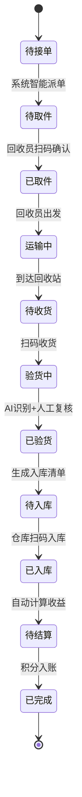

# One Recycle - 旧物回收平台

One Recycle 是一个基于微服务架构的旧物回收平台。用户发起回收订单，系统调度快递员上门取件，仓库验货入库后自动以积分形式结算给用户，用户可发起提现。支持多租户、智能客服、语音下单、AI 识别验货等能力。

## 技术栈

**后端**: NestJS / Prisma ORM / PostgreSQL / Redis / Bull 队列 / Swagger
**前端**: Next.js + Ant Design (管理后台) / Taro + React (小程序客户端)
**部署**: Docker Compose / Kubernetes / GitHub Actions CI/CD / Nginx

## 项目结构

```
one-recycle/
├── server/                    # 后端服务 (NestJS)
│   ├── src/
│   │   ├── modules/           # 26 个业务模块
│   │   │   ├── order/         # 订单管理
│   │   │   ├── payment/       # 支付处理
│   │   │   ├── logistics/     # 物流追踪
│   │   │   ├── dispatch/      # 智能派单
│   │   │   ├── inventory/     # 库存管理
│   │   │   ├── account/       # 账户/提现
│   │   │   ├── points/        # 积分商城
│   │   │   ├── ai/            # AI 识别/对话
│   │   │   ├── customer/      # 智能客服
│   │   │   ├── voice-order/   # 语音下单
│   │   │   ├── auth/          # 认证鉴权
│   │   │   ├── user/          # 用户管理
│   │   │   └── ...            # 更多模块
│   │   ├── common/            # 公共模块 (guards/filters/interceptors/utils)
│   │   ├── config/            # 配置模块
│   │   └── prisma/            # Prisma 数据库配置
│   └── prisma/schema.prisma   # 55 个数据模型
├── apps/
│   ├── admin-web/             # 管理后台 (Next.js)
│   └── mini-client/           # 小程序客户端 (Taro)
├── deploy/
│   ├── config/                # 环境变量配置
│   ├── docker/                # Docker Compose 编排
│   ├── nginx/                 # Nginx 反向代理
│   ├── k8s/                   # Kubernetes 部署
│   └── scripts/               # 部署脚本
├── docs/                      # 项目文档
└── scripts/                   # 本地工具脚本
```

## 快速开始

### 环境要求

- Node.js >= 20
- PostgreSQL >= 15
- Redis >= 7
- pnpm (推荐)

### 安装与启动

```bash
# 安装后端依赖
cd server && npm install

# 配置环境变量
cp .env.example .env

# 执行数据库迁移
npx prisma migrate dev

# 启动开发服务
npm run start:dev
```

服务启动后访问：
- API: `http://localhost:3000`
- Swagger 文档: `http://localhost:3000/api/docs`
- 健康检查: `http://localhost:3000/health`

### 种子数据

```bash
cd server

# 全量种子数据
npm run seed

# 按模块导入
npm run seed:categories      # 分类数据
npm run seed:points-mall     # 积分商城
npm run seed:content-config   # 内容配置 (FAQ/回收规则)
```

## 开发

### 常用命令

```bash
cd server

npm run dev          # 开发模式 (热重载)
npm run build        # 构建
npm run lint         # ESLint 检查
npm run typecheck    # TypeScript 类型检查
npm run test         # 单元测试
npm run test:e2e     # E2E 测试
npm run test:cov     # 测试覆盖率
```

### 代码质量

```bash
# 单元测试 (覆盖率 >= 90%)
npm run test:cov:unit

# E2E 测试 (覆盖率 >= 80%)
npm run test:cov:e2e

# 生成 Allure 测试报告
npm run test:report
```

CI 失败诊断：设置 `LOG_LEVEL=debug` 与 `DB_LOG_QUERIES=true`

## 部署

### GitHub Actions 自动部署（推荐）

推送代码到 `prod` 分支自动触发部署到服务器：

```bash
git checkout prod
git push origin prod
```

首次使用需要配置 GitHub Secrets，详见 [部署指南](docs/GITHUB_ACTIONS_DEPLOY_GUIDE.md)。

### 其他部署方式

| 方式 | 文档 |
|------|------|
| 一键部署脚本 | [deploy/README.md](deploy/README.md) |
| 手动部署 | [deploy/docs/DEPLOY.md](deploy/docs/DEPLOY.md) |
| Kubernetes | [deploy/docs/K8S-DEPLOY.md](deploy/docs/K8S-DEPLOY.md) |

### Docker Compose 部署

```bash
cd deploy/docker
docker compose -f docker-compose.production.yml up -d
```

包含服务：PostgreSQL、Redis、API Gateway、7 个微服务、Nginx、Ollama AI

## 业务流程

### 订单生命周期



### 核心服务

| 服务 | 职责 |
|------|------|
| API Gateway | 统一入口，路由分发 |
| account-service | 账户管理、余额、提现 |
| order-service | 订单全生命周期管理 |
| dispatch-service | 智能派单调度 |
| logistics-service | 物流追踪、快递对接 |
| inventory-service | 库存管理、入库验货 |
| notification-service | 消息通知（微信模板/短信） |
| category-service | 物品分类管理 |
| message-queue | 异步任务处理 |
| payment-service | 支付、结算、退款 |

## 数据模型

项目包含 55 个数据模型，覆盖完整的回收业务：

- 用户体系: User, Address, UserIdentity, UserFeedback
- 订单体系: Order, OrderItem, OrderAssignment, OrderTimeline
- 物流体系: LogisticsOrder, LogisticsProvider, Courier
- 财务体系: Account, Payment, Withdrawal, Transaction, SettlementRecord
- 积分体系: PointsProduct, PointsOrder, PointsRecord, SignInRecord
- AI 体系: AIConversationLog, VoiceOrderSession, KnowledgeBase
- 多租户: Tenant, Staff, TenantAddress, PlatformWallet
- 配置体系: Category, RecyclePricingRule, FAQ, RecycleRule

详细数据库设计见 [docs/database.md](docs/database.md)

## 文档索引

| 文档 | 说明 |
|------|------|
| [API 接口文档](API_DOCUMENTATION.md) | 完整 API 接口列表 |
| [架构设计](docs/architecture.md) | 系统架构与混合模式设计 |
| [微服务设计](docs/microservices.md) | 微服务拆分与通信 |
| [数据库设计](docs/database.md) | 数据模型与关系 |
| [开发指南](docs/development-guide.md) | 开发规范与环境搭建 |
| [订单状态机](docs/order-state-machine-design.md) | 订单状态流转设计 |
| [API 概要](docs/api.md) | API 模块索引 |
| [部署指南](DEPLOY_GUIDE.md) | 完整部署文档 |
| [GitHub Actions 配置](docs/GITHUB_ACTIONS_DEPLOY_GUIDE.md) | CI/CD 详细配置 |
| [UI/UX 设计](docs/ui-ux.md) | 界面设计规范 |

## 许可证

MIT
