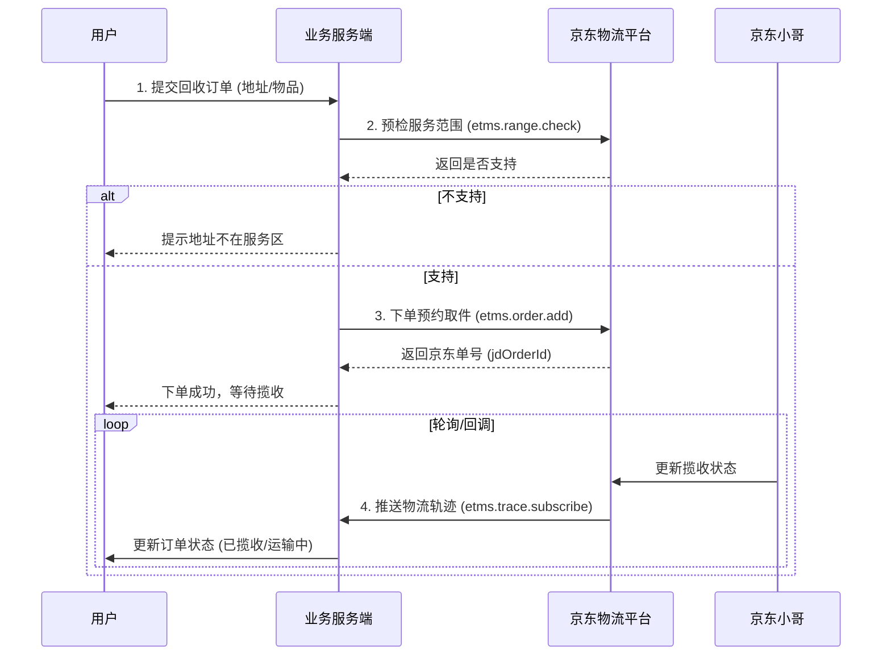

# 京东物流（JDL）上门回收业务接入技术方案

## 1. 业务背景与目标
本方案旨在基于京东物流开放平台（JDL）接入规范，实现“上门回收旧物”业务的物流履约能力。通过对接JDL API，实现系统自动检查服务范围、预约上门取件、物流轨迹追踪及运单管理，确保回收业务的履约效率与用户体验。

## 2. 总体架构设计

### 2.1 交互时序图


## 3. API 接口清单与规范

### 3.1 公共参数规范
所有接口均基于 HTTP POST 调用，Content-Type 为 `application/x-www-form-urlencoded` 或 `application/json`。

| 参数名 | 类型 | 必填 | 描述 |
|---|---|---|---|
| app_key | String | 是 | 开放平台分配的 AppKey |
| access_token | String | 是 | 授权令牌 (OAuth2.0) |
| timestamp | String | 是 | 时间戳 (yyyy-MM-dd HH:mm:ss) |
| v | String | 是 | 版本号 (默认 2.0) |
| method | String | 是 | 接口名称 |
| sign | String | 是 | 签名 (见签名算法) |
| param_json | String | 是 | 业务参数 JSON 字符串 |

### 3.2 核心接口定义

#### 3.2.1 揽收范围查询 (jingdong.etms.range.check)
**功能**: 校验用户地址是否在京东物流上门接货范围内。
**URL**: `https://api.jdl.com/routerjson` (示例)

**业务参数 (param_json)**:
```json
{
  "warehouseCode": "必填，发货仓编码(如虚拟仓)",
  "receiverAddress": "必填，用户详细地址",
  "receiverProvince": "选填，省",
  "receiverCity": "选填，市",
  "receiverCounty": "选填，区"
}
```
**返回参数**:
```json
{
  "code": "0",
  "message": "success",
  "result": {
    "isSupport": true, // 是否支持
    "reason": "" // 不支持原因
  }
}
```

#### 3.2.2 预约取件下单 (jingdong.etms.order.add)
**功能**: 创建上门回收取件运单。
**业务参数**:
```json
{
  "deliveryId": "必填，业务侧唯一订单号",
  "promiseTimeType": "1", // 1: 预约时间, 0: 立即
  "pickupTime": "2023-10-27 10:00:00", // 预约取件时间
  "senderName": "必填，寄件人(用户)姓名",
  "senderMobile": "必填，寄件人手机",
  "senderAddress": "必填，寄件人地址",
  "receiveName": "必填，收件人(回收中心)姓名",
  "receiveMobile": "必填，收件人手机",
  "receiveAddress": "必填，收件人地址",
  "packageCount": 1,
  "weight": 1.5, // 预估重量
  "goodsName": "旧书/旧衣"
}
```

#### 3.2.3 取消运单 (jingdong.etms.order.cancel)
**功能**: 用户取消回收订单或修改时间前调用。
**业务参数**:
```json
{
  "deliveryId": "必填，业务侧订单号",
  "jdOrderId": "必填，京东运单号",
  "cancelReason": "用户取消"
}
```

#### 3.2.4 物流轨迹查询 (jingdong.etms.trace.get)
**功能**: 查询运单实时状态。
**业务参数**:
```json
{
  "waybillCode": "必填，京东运单号"
}
```

## 4. 关键技术策略

### 4.1 签名算法
采用标准 MD5 签名：
1. 将所有系统参数 (除 sign) 和业务参数按 Key 字母升序排序。
2. 拼接字符串：`secretKey` + `key1` + `value1` + ... + `keyN` + `valueN` + `secretKey`。
3. 对字符串进行 MD5 运算并转大写。

### 4.2 幂等性设计
- **下单接口**: 依赖 `deliveryId` (业务订单号) 作为幂等键。若 JDL 返回 "订单号已存在"，视为成功并查询现有运单号。
- **回调处理**: 记录处理过的 `traceId` 或状态变更日志，重复回调直接返回成功。

### 4.3 错误码对照表
| 错误码 | 描述 | 处理策略 |
|---|---|---|
| 0 / 200 | 成功 | 正常流程 |
| 1001 | 系统错误 | 重试 (指数退避) |
| 2005 | 参数错误 | 报警并人工排查 |
| 3001 | 超出服务范围 | 提示用户不可服务 |
| 3002 | 预约时间不可用 | 提示用户重选时间 |

### 4.4 限流与熔断
- **阈值**: 单接口 QPS ≤ 50 (根据签约等级调整)。
- **策略**: 使用 Token Bucket 算法在客户端限流。
- **熔断**: 连续失败 10 次或错误率 > 20% 触发熔断，降级为 "系统维护中" 或切换备用物流商。

## 5. 实施计划

| 阶段 | 任务内容 | 交付物 | 负责人 | 周期 |
|---|---|---|---|---|
| **P1 调研** | 申请 JDL 开发者账号，获取 AppKey/Secret，确认 API 权限 | 账号及权限清单 | 研发 | T+2 |
| **P2 开发** | 封装 JdlClient SDK (签名/重试)，实现 4 个核心接口 | SDK 源码, 单元测试 | 研发 | T+5 |
| **P3 联调** | 使用 JDL 沙箱环境验证下单、取消、查轨迹全流程 | 联调测试报告 | 研发 | T+3 |
| **P4 生产** | 部署生产环境，配置日志监控与报警 | 上线 Checklist | 运维 | T+1 |

## 6. 质量门禁
1. **单元测试**: 核心 SDK 方法覆盖率 100%。
2. **性能指标**: P99 耗时 < 500ms (不包含 JDL 侧耗时)，QPS 支持 1000 (依赖服务商配额)。
3. **可用性**: 自动重试机制确保临时网络抖动不影响下单成功率。

---
*注：具体 URL 和参数字段以实际申请到的 JDL 官方文档为准，本文档作为标准化实施框架。*
