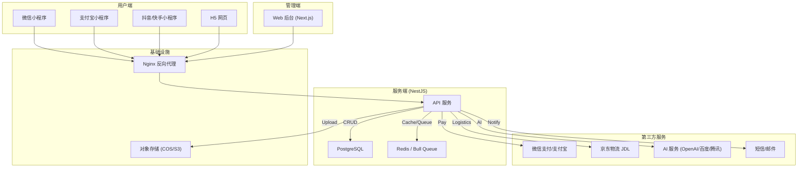
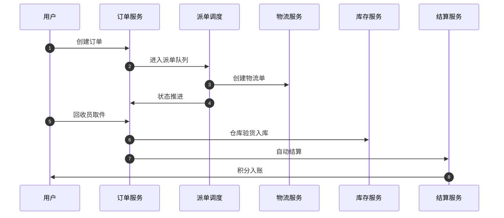
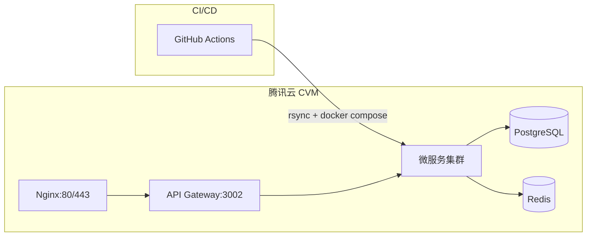

# OneRecycle - 架构设计文档

## 1. 概述

OneRecycle 是一个旧物回收平台，采用混合架构模式：开发环境使用 NestJS 单体应用，生产环境可拆分为多个微服务独立部署。平台支持微信、支付宝、抖音、快手等多端小程序。

## 2. 系统架构



## 3. 技术选型

| 领域 | 技术 | 理由 |
|------|------|------|
| **小程序** | Taro 4 + React | 一套代码多端编译 (微信/支付宝/抖音/H5) |
| **管理后台** | Next.js 14 + Tailwind CSS | SSR 性能，App Router 路由 |
| **后端框架** | NestJS 11 + TypeScript | 模块化 DI 架构，生态成熟 |
| **数据库** | PostgreSQL | JSONB、事务 ACID、稳定可靠 |
| **ORM** | Prisma | 类型安全，自动迁移 |
| **缓存/队列** | Redis + Bull | 高性能缓存和异步任务 |
| **部署** | Docker Compose / K8s | 容器化，环境一致 |
| **CI/CD** | GitHub Actions | prod 分支自动部署 |
| **代码管理** | pnpm Monorepo | 统一依赖管理 |

## 4. 混合架构模式

### 4.1 开发环境（单体模式）

所有业务模块在单个 NestJS 应用中运行，共享同一个数据库和 Redis，通过模块边界组织代码：

```
server/src/modules/
├── auth/           # 认证鉴权
├── user/           # 用户管理
├── order/          # 订单管理
├── payment/        # 支付处理
├── account/        # 账户余额
├── logistics/      # 物流追踪
├── dispatch/       # 智能派单
├── inventory/      # 库存管理
├── notification/   # 通知服务
├── queue/          # 队列处理
├── points/         # 积分体系
├── ai/             # AI 能力
├── customer/       # 智能客服
├── voice-order/    # 语音下单
├── content/        # 内容管理
├── settlement/     # 结算服务
├── tenant/         # 多租户
└── ...             # 更多模块
```

### 4.2 生产环境（微服务模式）

通过 Docker Compose 或 K8s 将核心模块拆分为独立服务，每个服务拥有独立进程和端口：

| 服务 | 端口 | 职责 |
|------|------|------|
| api-gateway | 3002 | 统一入口，路由分发 |
| account-service | 3001 | 账户管理、余额、提现 |
| order-service | 3003 | 订单全生命周期 |
| notification-service | 3004 | 多渠道通知 |
| inventory-service | 3009 | 库存、质检、入库 |
| category-service | 3008 | 分类、定价规则 |
| message-queue | 3010 | Bull 队列处理器 |
| postgres | 5432 | PostgreSQL 数据库 |
| redis | 6379 | Redis 缓存和队列 |
| nginx | 80/443 | 反向代理和负载均衡 |
| ollama | 11434 | 本地 AI 模型 |

### 4.3 服务间通信

- **外部通信**: RESTful API（客户端 -> API Gateway）
- **内部通信**: gRPC（微服务间），通过 Protocol Buffers 定义接口
- **异步通信**: Bull Queue（Redis），用于订单状态流转、支付处理、通知发送等

## 5. 核心业务流程

### 5.1 统一认证

1. 客户端调用平台 `login` 获取 `code`
2. 发送 `POST /api/auth/third-party/:platform` 携带 `code`
3. 服务端调用平台 API 换取 `openid`/`unionid`
4. 查询或创建用户记录，生成 JWT 返回

### 5.2 下单到结算



### 5.3 支付与提现

- 支付: 创建支付单 -> 调用第三方支付 -> 异步回调验签 -> 更新状态
- 提现: 冻结余额 -> 发起企业付款 -> 回调确认 -> 扣减/退回冻结

## 6. 安全设计

- **认证**: JWT + RS256，Redis 黑名单支持强制下线
- **支付**: 严格的回调验签和幂等性处理
- **数据**: 敏感信息加密存储，输入校验防 SQL 注入/XSS
- **限流**: 登录接口 10次/分钟，支付接口 20次/分钟

## 7. 部署架构



CI/CD 流程：推送 `prod` 分支 -> GitHub Actions -> rsync 上传 -> Docker Compose build + up -> 健康检查
