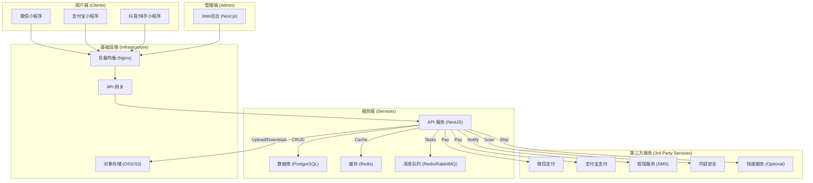

# OneRecycle - 多平台旧物回收小程序：架构设计文档

## 1. 概述

本文档旨在阐述 "OneRecycle" 多平台旧物回收小程序的技术架构、设计原则与关键决策。项目目标是构建一个稳定、可扩展且易于维护的三端系统（客户端、管理端、服务端），支持在微信、支付宝、抖音、快手等主流平台上运行。

## 2. 系统架构图

## 3. 技术选型

### 3.1 前端技术栈

- **小程序框架**: Taro 4.1.6
  - **优势**: 一套代码多端运行，支持微信、支付宝、抖音、快手等主流平台
  - **编译目标**: 微信小程序、支付宝小程序、H5、抖音小程序、快手小程序
- **开发语言**: TypeScript
- **UI 组件库**: Taro UI (图标组件、基础组件)
- **状态管理**: React Context + useReducer (轻量级状态管理)
- **样式方案**: CSS Modules + PostCSS
- **构建工具**: Webpack (Taro 内置)
- **性能优化**: 
  - 图片懒加载 (LazyImage组件)
  - 智能预加载 (imagePreloader工具)
  - 组件优化 (useMemo, useCallback)
  - 关键图片缓存机制

### 3.2 技术选型对比表

| 领域         | 技术/框架             | 理由                                                               |
| ------------ | --------------------- | ------------------------------------------------------------------ |
| **多端小程序** | **Taro 4 + React**    | 一套代码多端编译，React 生态成熟，社区活跃，对 TypeScript 支持良好。 |
| **管理后台**   | **Next.js + Ant Design** | 基于 React，SSR/SSG 提升首屏性能，Ant Design 提供高质量组件库。    |
| **服务端 API** | **Node.js + NestJS**  | TypeScript 支持，架构清晰（模块化、DI），性能优异，生态完善。      |
| **数据库**     | **PostgreSQL**        | 功能强大，支持 JSONB、地理空间数据，事务ACID，稳定性高。           |
| **ORM**        | **Prisma**            | 类型安全，自动生成 Client，Migration 工具链成熟，开发效率高。      |
| **缓存/队列**  | **Redis**             | 高性能键值存储，用作 Session、缓存和轻量级消息队列。               |
| **部署**       | **Docker + Nginx**    | 容器化实现环境一致性，Nginx 作为反向代理和负载均衡。               |
| **代码管理**   | **pnpm Monorepo**     | 统一管理多项目依赖，提升代码复用性，简化 CI/CD 流程。              |

## 4. 核心模块设计

### 4.1 用户端小程序 (Client Mini)

- **页面结构**:
  - `pages/index`: 首页，展示分类、快速入口、推荐内容
    - 顶部导航：城市选择、搜索功能、用户操作入口
    - 轮播横幅：环保活动、高价回收品类推广
    - 主要分类：10大回收品类（普通衣物、品牌鞋服、书籍、手机、黄金等）
    - 快速估价：我的宝贝估价功能，支持添加多个物品
    - 功能入口：旧衣换钱、数码回收、黄金变现
    - 衣物回收专区：展示回收流程和价格信息
  - `pages/recycle`: 回收下单页面，物品信息填写
  - `pages/orders`: 订单列表与详情
  - `pages/profile`: 个人中心，用户信息管理
  - `pages/address`: 地址管理
  - `pages/pricing`: 价格查询与估算
  - `pages/settings`: 系统设置

### 4.2 管理端 (Admin Web)

- **技术栈**: Next.js + Ant Design + TypeScript
- **核心功能模块**:
  - `dashboard`: 数据概览仪表板
  - `users`: 用户管理
  - `orders`: 订单管理
  - `couriers`: 快递员管理
  - `inventory`: 库存管理
  - `notifications`: 通知管理
  - `categories`: 分类管理
  - `settings`: 系统设置
- **组件架构**:
  - `Header`: 顶部导航栏，用户信息、通知中心
  - `Sidebar`: 侧边导航菜单
  - 响应式布局设计

### 4.3 服务端架构 (Services)

- **微服务模块**:
  - `account-service`: 用户账户服务
  - `order-service`: 订单管理服务
  - `payment-service`: 支付处理服务
  - `courier-service`: 快递员服务
  - `notification-service`: 通知服务
  - `category-service`: 分类管理服务
  - `inventory-service`: 库存管理服务
  - `dispatch-service`: 派单调度服务
  - `api-gateway`: API网关
  - `api`: 通用API服务

## 5. 核心业务流程

### 5.1. 统一认证与登录

1.  **客户端**: 调用平台 `login` 接口（如 `wx.login`）获取 `code`。
2.  **客户端 -> 服务端**: 发送 `POST /auth/login/{provider}` 请求，携带 `code` 和 `appId`。
3.  **服务端**:
    -   调用平台 API，用 `code` 换取 `openid` 和 `unionid`（如果可用）。
    -   查询 `user_identities` 表，检查 `openid` 是否存在。
        -   **存在**: 找到关联的 `user_id`。
        -   **不存在**:
            -   检查 `unionid` 是否能关联到已有用户，若能则绑定。
            -   否则，创建新的 `user` 和 `user_identity` 记录。
    -   使用 `user_id` 生成 JWT (JSON Web Token)。
4.  **服务端 -> 客户端**: 返回 JWT 和用户信息。客户端将 JWT 存储，并在后续请求的 `Authorization` 头中携带。

### 4.2. 下单与派单

1.  **用户**: 在小程序端填写回收物品信息、选择地址、预约上门时间，提交订单。
2.  **服务端**:
    -   创建订单（`orders` 表），状态为 `PENDING`。
    -   根据地址和业务规则，自动或手动指派快递员（`couriers`）。
    -   创建派单记录（`assignments`），状态为 `ASSIGNED`。
    -   通过消息队列或 WebSocket 通知快递员端有新订单。
3.  **快递员**: 接单后，状态更新为 `ACCEPTED`。上门取件、称重、确认物品后，更新订单明细（`order_items`）和总价，并将订单状态改为 `COMPLETED`。

### 4.3. 支付与结算

1.  **场景**: 用户支付服务费，或平台向用户支付回收款。
2.  **支付流程 (用户支付为例)**:
    -   **客户端**: 请求 `POST /payments/{orderId}/prepare`。
    -   **服务端**:
        -   创建支付记录（`payments`），状态为 `PENDING`。
        -   调用微信/支付宝统一下单接口，生成预支付交易单。
        -   将预支付信息（如 `prepay_id`）签名后返回给客户端。
    -   **客户端**: 拉起微信/支付宝支付。
    -   **支付平台 -> 服务端**: 异步发送支付结果通知到 `POST /payments/webhook/{provider}`。
    -   **服务端**:
        -   **验签**: 验证通知的合法性，防止伪造。
        -   **处理业务**: 更新 `payments` 和 `orders` 表的状态。
        -   **幂等性**: 记录已处理的 `transaction_id`，防止重复处理。

## 5. 部署架构

- **开发环境**: `docker-compose` 一键启动所有服务（API, DB, Redis）。
- **生产环境**:
    -   **API 服务**: 使用 PM2 或 Docker Swarm/Kubernetes 部署多个实例。
    -   **数据库/Redis**: 使用云服务商提供的托管服务（如 RDS, Memorystore）以保证高可用和备份。
    -   **静态资源**: 管理后台和小程序静态资源上传至对象存储（OSS/S3），通过 CDN 加速访问。
    -   **CI/CD**: 使用 GitHub Actions 或 Jenkins，在代码 push/merge 后自动运行测试、构建镜像、部署到目标环境。

## 6. 安全设计

- **认证与授权**:
    -   JWT 包含有效期（`exp`），并使用 `RS256` 等非对称加密算法。
    -   服务端 Redis 可存储 JWT 黑名单，用于强制用户下线。
    -   管理后台采用 RBAC (基于角色的访问控制)。
- **支付安全**:
    -   支付密钥、证书等敏感信息通过环境变量或配置中心管理，不硬编码。
    -   严格执行支付回调的验签和幂等性处理。
- **数据安全**:
    -   对用户手机号、地址等敏感信息在数据库中进行加密存储。
    -   所有外部输入都进行严格的校验和清洗，防止 SQL 注入、XSS 等攻击。
- **接口安全**:
    -   关键接口（如短信发送、登录）设置速率限制（Rate Limiting）。
    -   启用 CORS，只允许受信任的域进行跨域访问。
    -   图片、文本等用户上传内容接入平台的内容安全接口进行审核。