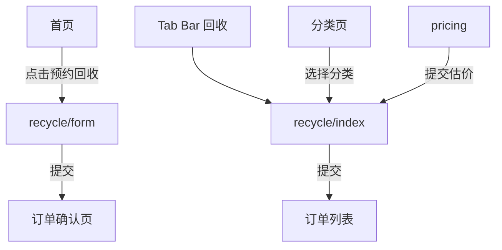
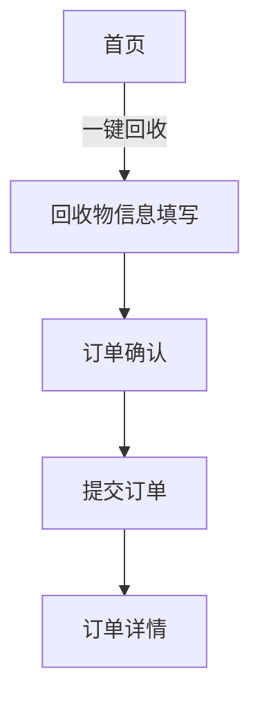
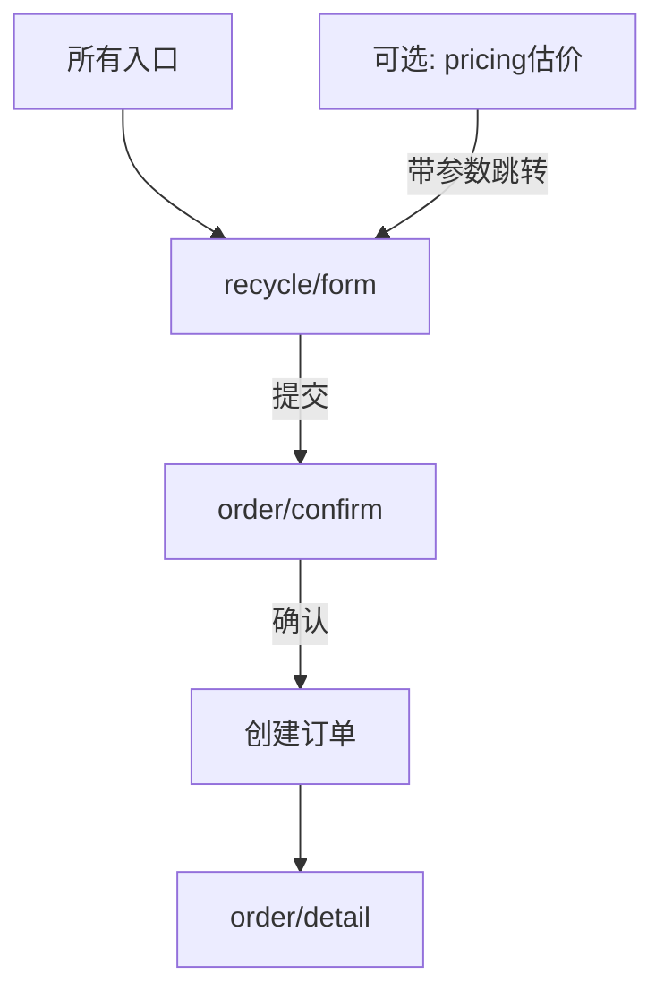

# 小程序页面重复性和功能完整性分析报告

## 一、分析概述

本报告对 OneRecycle 小程序的所有页面进行了全面分析，重点关注页面功能重复性、完整性以及用户流程的合理性。

**分析时间**: 2025-10-18  
**分析范围**: `/apps/client-mini/src/pages` 目录下所有页面  
**参考文档**: `/docs/ui-ux.md`, `/docs/development-guide.md`

## 二、页面清单

### 2.1 现有页面列表

| 页面路径 | 功能说明 | 状态 |
|---------|---------|------|
| `pages/index` | 首页 | ✅ 正常 |
| `pages/login` | 登录页 | ✅ 正常 |
| `pages/category` | 分类选择 | ✅ 正常 |
| `pages/recycle/index` | 回收下单（简化版） | ⚠️ 功能重复 |
| `pages/recycle/form` | 回收表单（完整版） | ✅ 正常 |
| `pages/pricing` | 在线估价 | ⚠️ 功能重复 |
| `pages/order/list` | 订单列表 | ✅ 正常 |
| `pages/order/detail` | 订单详情 | ✅ 正常 |
| `pages/order/confirm` | 订单确认 | ✅ 正常 |
| `pages/profile` | 个人中心 | ✅ 正常 |
| `pages/address` | 地址管理 | ✅ 正常 |
| `pages/settings` | 设置页 | ✅ 正常 |
| `pages/withdrawal` | 提现页 | ✅ 正常 |
| `pages/agreement` | 协议页 | ✅ 正常 |

## 三、重点问题分析

### 3.1 功能重复问题

#### 问题1: recycle/index 与 recycle/form 功能重复

**recycle/index 页面** (Tab Bar 入口)
```typescript
功能清单:
- ✓ 分类选择 (Picker)
- ✓ 预估重量输入 (Input)
- ✓ 物品描述 (Input)
- ✓ 上门地址选择 (Picker)
- ✓ 预约时间选择 (Picker)
- ✓ 京东快递开关 (Switch)
- ✓ 直接提交订单
```

**recycle/form 页面** (首页入口)
```typescript
功能清单:
- ✓ 分类选择 (CategorySelector 组件)
- ✓ 物品详细描述 (Textarea, 200字符)
- ✓ 预估重量 + 价格估算 (PriceEstimator 组件)
- ✓ 图片上传 (ImageUploader, 最多6张)
- ✓ 上门地址选择 (AddressSelector 组件)
- ✓ 上门时间选择 (TimeSelector 组件)
- ✓ 联系电话 (Input, 手机号验证)
- ✓ 备注信息 (Textarea, 100字符)
- ✓ 提交后跳转订单确认页
```

**对比结果**:
- `recycle/form` 功能更完整、组件化更好、用户体验更佳
- `recycle/index` 功能简陋，缺少图片上传、价格估算等关键功能
- 两个页面**功能重复度达 70%**，维护成本高

#### 问题2: pricing 页面与回收流程重复

**pricing 页面**
```typescript
功能清单:
- ✓ 分类选择
- ✓ 重量/设备类型选择
- ✓ 价格估算显示
- ✓ 上门服务开关
- ✓ 上门时间选择
- ✓ 提交估价后跳转到 recycle/index
```

**问题分析**:
1. pricing 页面完成估价后，仍需跳转到 `recycle/index` 重新填写信息
2. 用户需要重复输入分类、重量等信息
3. 流程冗长：`pricing` → `recycle/index` → 提交订单
4. 与标准流程不符（UI/UX文档建议直接进入回收表单）

### 3.2 用户流程混乱

#### 当前的多个入口和流程



**问题**:
- 3个不同的入口指向2个不同的回收页面
- `recycle/index` 和 `recycle/form` 提交后的跳转目标不同
- 用户体验不一致

#### 标准流程（UI/UX 文档）



### 3.3 页面功能完整性评估

| 页面 | 功能完整性 | 缺失/问题 |
|-----|-----------|----------|
| `recycle/index` | 60% | 缺少图片上传、价格估算、联系电话、详细描述 |
| `recycle/form` | 95% | 缺少京东快递选项（可选） |
| `pricing` | 70% | 缺少地址选择、图片上传，与回收流程脱节 |
| `order/list` | 90% | 功能完善 |
| `order/detail` | 95% | 功能完善，包含完整的订单信息和操作 |
| `profile` | 90% | 功能完善，集成了账户系统 |

## 四、优化建议

### 4.1 合并重复页面

#### 方案A: 保留 recycle/form，废弃 recycle/index

**优点**:
- `recycle/form` 功能更完整
- 组件化更好，便于维护
- 符合UI/UX设计规范

**实施步骤**:
1. 将 Tab Bar 的回收入口改为 `pages/recycle/index`
2. 将 `recycle/index` 中的京东快递功能迁移到 `recycle/form`
3. 删除或归档 `recycle/index.tsx`
4. 更新所有跳转路径

#### 方案B: 保留 recycle/index，增强功能

**优点**:
- 保持 Tab Bar 入口不变
- 改动较小

**实施步骤**:
1. 将 `recycle/form` 的组件和功能迁移到 `recycle/index`
2. 添加图片上传、价格估算等功能
3. 删除 `recycle/form`

**推荐**: **方案A**，因为 `recycle/form` 的代码质量和架构更好

### 4.2 重构 pricing 页面

#### 选项1: 独立估价工具（推荐）

```typescript
// 改造后的 pricing 页面流程
1. 用户选择分类、重量
2. 显示估价结果
3. 点击"立即回收"按钮
4. 跳转到 recycle/form，自动填充分类、重量、预估价格
5. 用户补充其他信息后提交订单
```

**代码示例**:
```typescript
// pricing/index.tsx
const onSubmitEstimate = () => {
  Taro.navigateTo({
    url: `/pages/recycle/index?categoryId=${categoryId}&weight=${weight}&estimatedPrice=${estimatedPrice}`
  })
}
```

#### 选项2: 移除 pricing 页面

- 将估价功能集成到 `recycle/form` 的 `PriceEstimator` 组件中
- 用户在填写表单时实时看到价格估算
- 减少页面跳转，提升体验

### 4.3 统一用户流程

#### 目标流程



#### 入口统一

| 入口 | 目标页面 | 携带参数 |
|-----|---------|---------|
| 首页"预约回收" | `recycle/form` | 无 |
| Tab Bar"回收" | `recycle/form` | 无 |
| 分类页选择分类 | `recycle/form` | `categoryId`, `categoryName` |
| pricing估价 | `recycle/form` | `categoryId`, `weight`, `estimatedPrice` |

### 4.4 代码重构建议

#### 1. 提取共享组件

已有组件（位于 `recycle/form`）:
- `CategorySelector` - 分类选择器
- `ImageUploader` - 图片上传
- `AddressSelector` - 地址选择器
- `TimeSelector` - 时间选择器
- `PriceEstimator` - 价格估算器

建议新增:
- `JDExpressSelector` - 京东快递选项（从 `recycle/index` 提取）
- `OrderSummary` - 订单摘要卡片（可复用）

#### 2. 统一数据模型

```typescript
// types/recycle.ts
export interface RecycleFormData {
  categoryId: number
  category: string
  description: string
  weight: string
  images: string[]
  pickupAddress: string
  addressId: number
  pickupTime: string
  contactPhone: string
  remarks: string
  useJDExpress?: boolean  // 新增京东快递选项
  estimatedPrice?: number // 新增预估价格
}
```

#### 3. 统一服务层接口

```typescript
// services/order.ts
export interface CreateOrderParams {
  categoryId: number
  items: OrderItem[]
  addressId: number
  appointmentTime: string
  notes?: string
  channel?: 'platform' | 'jd-express'
  doorToDoorService: boolean
}
```

### 4.5 配置文件调整

#### app.config.ts 修改

```typescript
export default {
  pages: [
    'pages/index/index',
    'pages/login/index',
    'pages/category/index',
    'pages/recycle/index',  // 移除 recycle/index
    'pages/order/index',
    'pages/order/confirm/index',
    'pages/order/detail/index',
    'pages/order/list/index',
    'pages/pricing/index',       // 可选：保留或移除
    // ... 其他页面
  ],
  tabBar: {
    list: [
      { pagePath: 'pages/index/index', text: '首页' },
      { pagePath: 'pages/recycle/index', text: '回收' },  // 修改
      { pagePath: 'pages/order/list/index', text: '订单' },
      { pagePath: 'pages/profile/index', text: '我的' }
    ]
  }
}
```

## 五、实施计划

### 阶段1: 合并回收页面 (优先级: 高)

**工作量**: 2-3天

1. ✅ 在 `recycle/form` 中添加京东快递功能
2. ✅ 更新 `app.config.ts` Tab Bar 配置
3. ✅ 更新所有跳转到 `recycle/index` 的路径
4. ✅ 测试所有入口和流程
5. ✅ 删除或归档 `recycle/index`

### 阶段2: 重构 pricing 页面 (优先级: 中)

**工作量**: 1-2天

1. ✅ 修改 pricing 提交逻辑，跳转到 `recycle/form` 而非 `recycle/index`
2. ✅ 在 `recycle/form` 中支持接收 pricing 传递的参数
3. ✅ 测试估价 → 回收的完整流程
4. ✅ 优化 UI/UX

### 阶段3: 代码优化 (优先级: 中)

**工作量**: 2-3天

1. ✅ 提取共享组件
2. ✅ 统一数据模型和接口
3. ✅ 重构重复代码
4. ✅ 添加单元测试
5. ✅ 更新文档

### 阶段4: 测试和上线 (优先级: 高)

**工作量**: 2天

1. ✅ 功能测试
2. ✅ 回归测试
3. ✅ 性能测试
4. ✅ 用户验收测试
5. ✅ 发布上线

## 六、预期效果

### 6.1 代码质量提升

- 减少重复代码 **30-40%**
- 页面数量减少 **1-2个**
- 组件复用率提升 **50%**

### 6.2 用户体验改善

- 减少页面跳转 **1-2次**
- 表单填写更流畅
- 流程更清晰统一

### 6.3 维护成本降低

- 单一回收入口，便于维护
- 组件化程度提高，bug修复效率提升
- 代码结构更清晰

## 七、风险评估

| 风险 | 影响 | 概率 | 应对措施 |
|-----|------|------|---------|
| Tab Bar 路径变更导致缓存问题 | 中 | 中 | 发布时清除小程序缓存，引导用户更新 |
| 用户习惯改变 | 低 | 中 | 提供新手引导，保持功能一致性 |
| 数据迁移问题 | 低 | 低 | 不涉及数据迁移，只是页面重构 |
| 回归测试工作量 | 中 | 高 | 制定详细测试计划，自动化测试 |

## 八、总结

通过本次分析，发现小程序存在以下主要问题:

1. **功能重复**: `recycle/index`, `recycle/form`, `pricing` 三个页面存在严重的功能重复
2. **流程混乱**: 多个入口指向不同页面，用户体验不一致
3. **维护困难**: 重复代码多，修改需要同步多个页面

**核心建议**:
- 合并 `recycle/index` 和 `recycle/form`，保留功能更完整的 `recycle/form`
- 重构 `pricing` 页面，使其成为独立的估价工具或集成到回收表单
- 统一所有入口到单一的回收表单页面
- 提取共享组件，提高代码复用率

实施这些优化后，预期可以:
- ✅ 减少 30-40% 的重复代码
- ✅ 提升用户体验，减少页面跳转
- ✅ 降低维护成本，便于后续功能扩展
- ✅ 符合 UI/UX 设计规范，流程更清晰

---

**报告生成时间**: 2025-10-18  
**分析人员**: Warp AI Agent  
**版本**: v1.0
