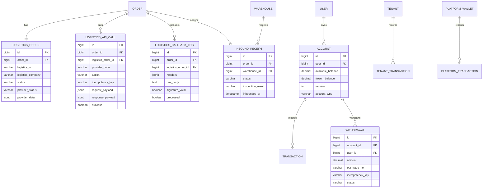
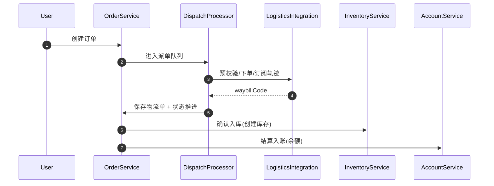
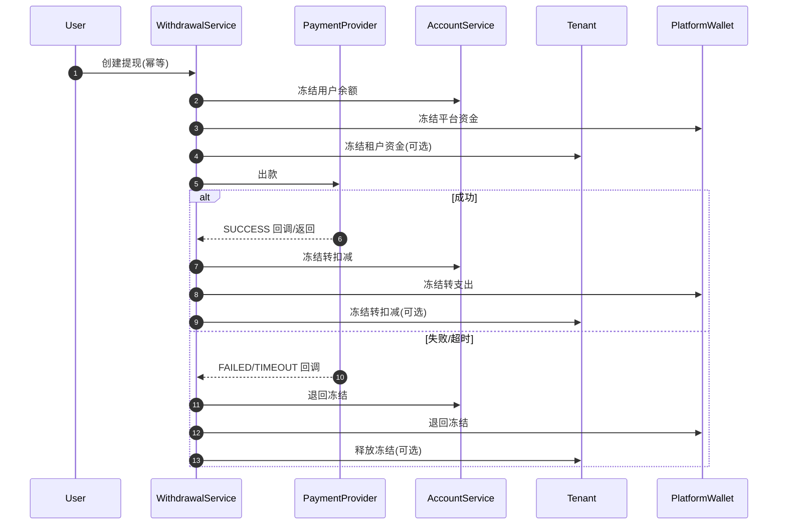

# OneRecycle - 数据库设计文档

## 1. ER 图 (Entity-Relationship Diagram)

使用 Mermaid 语法绘制核心实体关系图。


## 1.1 增量实体（物流/入库/资金）



## 1.2 关键时序（下单到入库入账）



## 1.3 关键时序（提现冻结到成功/失败退回）



## 2. 实际表结构定义

项目采用微服务架构，每个服务有独立的数据库schema。以下是各服务的实际Prisma schema定义：

### 2.1 账户服务 (account-service)

```prisma
// services/account-service/prisma/schema.prisma

/// 用户主表
model User {
  id         BigInt        @id @default(autoincrement())
  mobile     String?       @db.VarChar(20)
  nickname   String?       @db.VarChar(50)
  avatarUrl  String?       @map("avatar_url") @db.VarChar(255)
  status     UserStatus    @default(ACTIVE)
  createdAt  DateTime      @default(now()) @map("created_at")
  updatedAt  DateTime      @updatedAt @map("updated_at")
  identities UserIdentity[]
  addresses  Address[]

  @@map("users")
}

/// 用户多平台身份
model UserIdentity {
  id        BigInt   @id @default(autoincrement())
  userId    BigInt   @map("user_id")
  provider  String   @db.VarChar(20) // 'wechat', 'alipay', 'douyin'
  appId     String   @map("app_id") @db.VarChar(100)
  openid    String   @db.VarChar(100)
  unionid   String?  @db.VarChar(100)
  extraData Json?    @map("extra_data")
  createdAt DateTime @default(now()) @map("created_at")
  user      User     @relation(fields: [userId], references: [id])

  @@unique([provider, openid])
  @@index([userId])
  @@map("user_identities")
}

/// 用户地址
model Address {
  id        BigInt   @id @default(autoincrement())
  userId    BigInt   @map("user_id")
  consignee String   @db.VarChar(50)
  mobile    String   @db.VarChar(20)
  province  String   @db.VarChar(50)
  city      String   @db.VarChar(50)
  district  String   @db.VarChar(50)
  detail    String   @db.VarChar(255)
  isDefault Boolean  @default(false) @map("is_default")
  createdAt DateTime @default(now()) @map("created_at")
  updatedAt DateTime @updatedAt @map("updated_at")
  user      User     @relation(fields: [userId], references: [id])

  @@index([userId])
  @@map("addresses")
}

enum UserStatus {
  ACTIVE
  INACTIVE
  BANNED
}
```

### 2.2 订单服务 (order-service)

```prisma
// services/order-service/prisma/schema.prisma

model Order {
  id               BigInt        @id @default(autoincrement())
  orderNo          String        @unique @map("order_no") @db.VarChar(40)
  userId           BigInt        @map("user_id")
  addressId        BigInt        @map("address_id")
  status           OrderStatus   @default(PENDING)
  expectPickupTime DateTime      @map("expect_pickup_time")
  actualPickupTime DateTime?     @map("actual_pickup_time")
  estimatedAmount  Decimal       @default(0) @map("estimated_amount") @db.Decimal(10, 2)
  settlementAmount Decimal       @default(0) @map("settlement_amount") @db.Decimal(10, 2)
  payAmount        Decimal       @default(0) @map("pay_amount") @db.Decimal(10, 2)
  channel          String        @db.VarChar(30) // 'WECHAT_MP', 'ALIPAY_MP'
  remark           String?       @db.VarChar(500)
  createdAt        DateTime      @default(now()) @map("created_at")
  updatedAt        DateTime      @updatedAt @map("updated_at")
  items            OrderItem[]
  assignments      Assignment[]

  @@index([userId, status, createdAt])
  @@map("orders")
}

model OrderItem {
  id              BigInt        @id @default(autoincrement())
  orderId         BigInt        @map("order_id")
  categoryId      BigInt        @map("category_id") // 分类ID
  categoryName    String        @map("category_name") @db.VarChar(100) // 分类名称快照
  itemName        String?       @map("item_name") @db.VarChar(100) // 具体物品名称
  brand           String?       @db.VarChar(50) // 品牌
  model           String?       @db.VarChar(100) // 型号
  quality         ItemQuality?  // 物品成色
  images          String[]      // 物品照片
  estimatedWeight Decimal?      @map("estimated_weight") @db.Decimal(10, 2) // 预估重量
  actualWeight    Decimal?      @map("actual_weight") @db.Decimal(10, 2) // 实际重量
  unit            String        @default("kg") @db.VarChar(20) // 计量单位
  unitPrice       Decimal       @map("unit_price") @db.Decimal(10, 2) // 单价
  amount          Decimal       @db.Decimal(10, 2) // 小计金额
  remark          String?       @db.VarChar(500) // 备注
  createdAt       DateTime      @default(now()) @map("created_at")
  updatedAt       DateTime      @updatedAt @map("updated_at")
  order           Order         @relation(fields: [orderId], references: [id])

  @@index([orderId])
  @@index([categoryId])
  @@map("order_items")
}

enum ItemQuality {
  EXCELLENT  // 全新/几乎全新
  GOOD       // 良好
  FAIR       // 一般
  POOR       // 较差
}

model Assignment {
  id         BigInt           @id @default(autoincrement())
  orderId    BigInt           @map("order_id")
  courierId  BigInt           @map("courier_id")
  status     AssignmentStatus @default(ASSIGNED)
  acceptedAt DateTime?        @map("accepted_at")
  arrivedAt  DateTime?        @map("arrived_at")
  finishedAt DateTime?        @map("finished_at")
  createdAt  DateTime         @default(now()) @map("created_at")
  order      Order            @relation(fields: [orderId], references: [id])

  @@index([orderId])
  @@index([courierId, status])
  @@map("assignments")
}

enum OrderStatus {
  PENDING      // 待派单
  ASSIGNED     // 待接单
  ACCEPTED     // 待上门
  PROCESSING   // 回收中
  COMPLETED    // 已完成
  CANCELLED    // 已取消
}

enum AssignmentStatus {
  ASSIGNED
  ACCEPTED
  REJECTED
  ARRIVED
  FINISHED
  CANCELLED
}
```

### 2.3 分类服务 (category-service)

```prisma
// services/category-service/prisma/schema.prisma

/// 回收品类分类（支持多级分类）
model Category {
  id          BigInt          @id @default(autoincrement())
  name        String          @db.VarChar(50)
  code        String          @unique @db.VarChar(50) // 分类编码，如 'clothing', 'electronics'
  description String?         @db.VarChar(500)
  parentId    BigInt?         @map("parent_id") // 父分类ID，支持多级分类
  level       Int             @default(1) // 分类层级：1-一级分类，2-二级分类
  icon        String?         @db.VarChar(255) // 图标URL
  iconType    IconType        @default(IMAGE) @map("icon_type") // 图标类型
  coverImage  String?         @map("cover_image") @db.VarChar(255) // 封面图
  sortOrder   Int             @default(0) @map("sort_order") // 排序权重
  isActive    Boolean         @default(true) @map("is_active")
  isHot       Boolean         @default(false) @map("is_hot") // 是否热门分类
  unit        String          @default("kg") @db.VarChar(20) // 计量单位：kg, 件, 个
  createdAt   DateTime        @default(now()) @map("created_at")
  updatedAt   DateTime        @updatedAt @map("updated_at")

  parent      Category?       @relation("CategoryHierarchy", fields: [parentId], references: [id])
  children    Category[]      @relation("CategoryHierarchy")
  pricingRules PricingRule[]
  items       RecyclableItem[]

  @@index([parentId])
  @@index([isActive, sortOrder])
  @@map("categories")
}

/// 计费策略（支持阶梯定价、区域定价）
model PricingRule {
  id            BigInt        @id @default(autoincrement())
  categoryId    BigInt        @map("category_id")
  name          String        @db.VarChar(100) // 规则名称
  regionCode    String?       @map("region_code") @db.VarChar(50) // 区域编码，null表示全国通用
  basePrice     Decimal       @map("base_price") @db.Decimal(10, 2) // 基础单价（元/单位）
  pricingType   PricingType   @default(FIXED) @map("pricing_type") // 定价类型
  tierConfig    Json?         @map("tier_config") // 阶梯定价配置 [{minWeight: 0, maxWeight: 10, price: 2.5}]
  qualityFactor Json?         @map("quality_factor") // 品质系数 {excellent: 1.2, good: 1.0, fair: 0.8, poor: 0.5}
  minWeight     Decimal?      @map("min_weight") @db.Decimal(10, 2) // 最小起收重量
  maxWeight     Decimal?      @map("max_weight") @db.Decimal(10, 2) // 最大收购重量
  isActive      Boolean       @default(true) @map("is_active")
  effectiveFrom DateTime      @map("effective_from") // 生效开始时间
  effectiveTo   DateTime?     @map("effective_to") // 生效结束时间
  createdAt     DateTime      @default(now()) @map("created_at")
  updatedAt     DateTime      @updatedAt @map("updated_at")

  category      Category      @relation(fields: [categoryId], references: [id])

  @@index([categoryId, isActive])
  @@index([regionCode])
  @@map("pricing_rules")
}

/// 可回收物品详细定义
model RecyclableItem {
  id          BigInt   @id @default(autoincrement())
  categoryId  BigInt   @map("category_id")
  name        String   @db.VarChar(100) // 物品名称，如 "iPhone 13 Pro"
  brand       String?  @db.VarChar(50) // 品牌
  model       String?  @db.VarChar(100) // 型号
  description String?  @db.VarChar(500) // 描述
  images      String[] // 参考图片URL数组
  tags        String[] // 标签，如 ["高价回收", "热门"]
  avgPrice    Decimal  @map("avg_price") @db.Decimal(10, 2) // 平均回收价
  priceRange  String?  @map("price_range") @db.VarChar(50) // 价格区间显示，如 "50-200元/kg"
  isActive    Boolean  @default(true) @map("is_active")
  sortOrder   Int      @default(0) @map("sort_order")
  createdAt   DateTime @default(now()) @map("created_at")
  updatedAt   DateTime @updatedAt @map("updated_at")

  category    Category @relation(fields: [categoryId], references: [id])

  @@index([categoryId, isActive])
  @@map("recyclable_items")
}

enum IconType {
  IMAGE    // 图片图标
  ICON     // 字体图标
  EMOJI    // Emoji表情
}

enum PricingType {
  FIXED      // 固定单价
  TIERED     // 阶梯定价（按重量区间）
  QUALITY    // 品质定价（按物品成色）
  DYNAMIC    // 动态定价（市场价格波动）
}
```

### 2.4 库存服务 (inventory-service)

```prisma
// services/inventory-service/prisma/schema.prisma

model InventoryItem {
  id           BigInt                 @id @default(autoincrement())
  categoryId   BigInt                 @map("category_id")
  name         String                 @db.VarChar(100)
  description  String?                @db.VarChar(500)
  unit         String                 @db.VarChar(20) // 单位，如 kg, 件, 个等
  quantity     Decimal                @db.Decimal(12, 2) // 库存数量
  unitPrice    Decimal                @map("unit_price") @db.Decimal(10, 2) // 单价
  totalPrice   Decimal                @map("total_price") @db.Decimal(12, 2) // 总价值
  location     String?                @db.VarChar(100) // 存放位置
  status       InventoryStatus        @default(IN_STOCK)
  createdAt    DateTime               @default(now()) @map("created_at")
  updatedAt    DateTime               @updatedAt @map("updated_at")
  transactions InventoryTransaction[]
  salesRecords SalesRecord[]

  @@map("inventory_items")
}

model InventoryTransaction {
  id          BigInt          @id @default(autoincrement())
  itemId      BigInt          @map("item_id")
  type        TransactionType
  quantity    Decimal         @db.Decimal(12, 2) // 变动数量
  unitPrice   Decimal         @map("unit_price") @db.Decimal(10, 2) // 单价
  totalPrice  Decimal         @map("total_price") @db.Decimal(12, 2) // 总价值
  referenceId String?         @map("reference_id") @db.VarChar(50) // 关联订单ID等
  notes       String?         @db.VarChar(500)
  createdAt   DateTime        @default(now()) @map("created_at")
  item        InventoryItem   @relation(fields: [itemId], references: [id])

  @@index([itemId])
  @@map("inventory_transactions")
}

model SalesRecord {
  id         BigInt        @id @default(autoincrement())
  itemId     BigInt        @map("item_id")
  quantity   Decimal       @db.Decimal(12, 2)
  unitPrice  Decimal       @map("unit_price") @db.Decimal(10, 2)
  totalPrice Decimal       @map("total_price") @db.Decimal(12, 2)
  orderId    String        @map("order_id") @db.VarChar(50)
  customerId BigInt        @map("customer_id")
  soldAt     DateTime      @map("sold_at")
  notes      String?       @db.VarChar(500)
  createdAt  DateTime      @default(now()) @map("created_at")
  item       InventoryItem @relation(fields: [itemId], references: [id])

  @@index([itemId])
  @@index([orderId])
  @@map("sales_records")
}

enum InventoryStatus {
  IN_STOCK     // 在库
  LOW_STOCK    // 库存不足
  OUT_OF_STOCK // 缺货
}

enum TransactionType {
  INBOUND      // 入库
  OUTBOUND     // 出库
  ADJUSTMENT   // 调整
}
```

### 2.5 支付服务 (payment-service)

```prisma
// services/payment-service/prisma/schema.prisma

/// 支付记录（用户支付服务费）
model Payment {
  id            BigInt          @id @default(autoincrement())
  orderId       BigInt          @map("order_id")
  userId        BigInt          @map("user_id")
  provider      PaymentProvider @map("provider")
  paymentType   PaymentType     @default(ORDER_FEE) @map("payment_type") // 支付类型
  outTradeNo    String          @unique @map("out_trade_no") @db.VarChar(128)
  transactionId String?         @map("transaction_id") @db.VarChar(128)
  total         Decimal         @db.Decimal(10, 2)
  status        PaymentStatus   @default(PENDING)
  paidAt        DateTime?       @map("paid_at") // 支付完成时间
  notifyRaw     Json?           @map("notify_raw")
  remark        String?         @db.VarChar(500)
  createdAt     DateTime        @default(now()) @map("created_at")
  updatedAt     DateTime        @updatedAt @map("updated_at")
  refunds       Refund[]

  @@index([orderId])
  @@index([userId, status])
  @@map("payments")
}

/// 退款记录
model Refund {
  id           BigInt       @id @default(autoincrement())
  paymentId    BigInt       @map("payment_id")
  outRefundNo  String       @unique @map("out_refund_no") @db.VarChar(128)
  refundAmount Decimal      @map("refund_amount") @db.Decimal(10, 2)
  status       RefundStatus @default(PROCESSING)
  reason       String?      @db.VarChar(255)
  refundedAt   DateTime?    @map("refunded_at")
  notifyRaw    Json?        @map("notify_raw")
  createdAt    DateTime     @default(now()) @map("created_at")
  updatedAt    DateTime     @updatedAt @map("updated_at")
  payment      Payment      @relation(fields: [paymentId], references: [id])

  @@index([paymentId])
  @@map("refunds")
}

/// 用户账户余额
model UserAccount {
  id            BigInt              @id @default(autoincrement())
  userId        BigInt              @unique @map("user_id")
  balance       Decimal             @default(0) @db.Decimal(12, 2) // 可用余额
  frozenAmount  Decimal             @default(0) @map("frozen_amount") @db.Decimal(12, 2) // 冻结金额
  totalIncome   Decimal             @default(0) @map("total_income") @db.Decimal(12, 2) // 累计收入
  totalWithdraw Decimal             @default(0) @map("total_withdraw") @db.Decimal(12, 2) // 累计提现
  createdAt     DateTime            @default(now()) @map("created_at")
  updatedAt     DateTime            @updatedAt @map("updated_at")
  transactions  AccountTransaction[]
  withdrawals   Withdrawal[]

  @@map("user_accounts")
}

/// 账户流水记录
model AccountTransaction {
  id            BigInt            @id @default(autoincrement())
  accountId     BigInt            @map("account_id")
  type          TransactionType   // 交易类型
  amount        Decimal           @db.Decimal(12, 2) // 金额（正数为收入，负数为支出）
  balanceBefore Decimal           @map("balance_before") @db.Decimal(12, 2) // 交易前余额
  balanceAfter  Decimal           @map("balance_after") @db.Decimal(12, 2) // 交易后余额
  orderId       BigInt?           @map("order_id") // 关联订单ID
  withdrawalId  BigInt?           @map("withdrawal_id") // 关联提现ID
  description   String            @db.VarChar(255) // 交易描述
  createdAt     DateTime          @default(now()) @map("created_at")
  account       UserAccount       @relation(fields: [accountId], references: [id])

  @@index([accountId, createdAt])
  @@index([orderId])
  @@map("account_transactions")
}

/// 提现记录
model Withdrawal {
  id            BigInt           @id @default(autoincrement())
  accountId     BigInt           @map("account_id")
  userId        BigInt           @map("user_id")
  withdrawNo    String           @unique @map("withdraw_no") @db.VarChar(64) // 提现单号
  amount        Decimal          @db.Decimal(12, 2) // 提现金额
  fee           Decimal          @default(0) @db.Decimal(10, 2) // 手续费
  actualAmount  Decimal          @map("actual_amount") @db.Decimal(12, 2) // 实际到账金额
  method        WithdrawMethod   // 提现方式
  accountName   String           @map("account_name") @db.VarChar(100) // 收款账户名
  accountNo     String           @map("account_no") @db.VarChar(100) // 收款账号
  bankName      String?          @map("bank_name") @db.VarChar(100) // 银行名称（银行卡提现）
  status        WithdrawStatus   @default(PENDING)
  appliedAt     DateTime         @default(now()) @map("applied_at") // 申请时间
  processedAt   DateTime?        @map("processed_at") // 处理时间
  completedAt   DateTime?        @map("completed_at") // 完成时间
  failReason    String?          @map("fail_reason") @db.VarChar(255) // 失败原因
  transactionId String?          @map("transaction_id") @db.VarChar(128) // 第三方交易号
  remark        String?          @db.VarChar(500)
  createdAt     DateTime         @default(now()) @map("created_at")
  updatedAt     DateTime         @updatedAt @map("updated_at")
  account       UserAccount      @relation(fields: [accountId], references: [id])

  @@index([userId, status])
  @@index([status, appliedAt])
  @@map("withdrawals")
}

enum PaymentProvider {
  WECHAT     // 微信支付
  ALIPAY     // 支付宝
  BANK       // 银行转账
}

enum PaymentType {
  ORDER_FEE      // 订单服务费
  DEPOSIT        // 押金
  OTHER          // 其他
}

enum PaymentStatus {
  PENDING    // 待支付
  SUCCESS    // 支付成功
  FAILED     // 支付失败
  CLOSED     // 已关闭
  REFUNDED   // 已退款
}

enum RefundStatus {
  PROCESSING // 处理中
  SUCCESS    // 退款成功
  FAILED     // 退款失败
}

enum TransactionType {
  INCOME_ORDER      // 订单收入
  INCOME_REFUND     // 退款收入
  WITHDRAW          // 提现
  WITHDRAW_FEE      // 提现手续费
  FREEZE            // 冻结
  UNFREEZE          // 解冻
  ADJUSTMENT        // 调整
}

enum WithdrawMethod {
  WECHAT     // 微信零钱
  ALIPAY     // 支付宝
  BANK_CARD  // 银行卡
}

enum WithdrawStatus {
  PENDING    // 待审核
  APPROVED   // 已审核
  PROCESSING // 处理中
  COMPLETED  // 已完成
  FAILED     // 失败
  REJECTED   // 已拒绝
}
```

## 3. 数据库设计特点

### 3.1 微服务数据库隔离

- **独立数据库**: 每个微服务拥有独立的数据库实例，确保服务间的数据隔离
- **数据一致性**: 通过事件驱动和Saga模式保证跨服务的数据一致性
- **服务通信**: 服务间通过gRPC进行数据交换，避免直接数据库访问

### 3.2 索引策略

#### 账户服务索引

- **`user_identities`**: `(provider, openid)` 联合唯一索引用于快速查找用户身份
- **`addresses`**: `user_id` 索引用于查询用户地址列表

#### 订单服务索引

- **`orders`**: `(user_id, status, created_at)` 联合索引用于高效查询用户订单列表
- **`orders`**: `order_no` 唯一索引用于订单号查询
- **`assignments`**: `(courier_id, status)` 联合索引用于查询快递员任务列表
- **`order_items`**: `order_id` 索引用于查询订单明细

#### 支付服务索引

- **`payments`**: `out_trade_no` 唯一索引用于处理支付回调
- **`payments`**: `order_id` 索引用于关联订单查询
- **`refunds`**: `out_refund_no` 唯一索引用于退款查询

#### 库存服务索引

- **`inventory_items`**: `category_id` 索引用于分类查询
- **`inventory_transactions`**: `item_id` 索引用于库存变动历史
- **`sales_records`**: `(item_id, order_id)` 索引用于销售记录查询

### 3.3 数据类型设计

- **金额字段**: 统一使用 `Decimal(10, 2)` 确保精度
- **重量字段**: 使用 `Decimal(10, 2)` 或 `Decimal(12, 2)` 支持精确计量
- **时间字段**: 统一使用 `DateTime` 类型，包含 `created_at` 和 `updated_at`
- **状态字段**: 使用枚举类型确保数据一致性
- **JSON字段**: 用于存储灵活的扩展数据（如支付回调原始数据）
