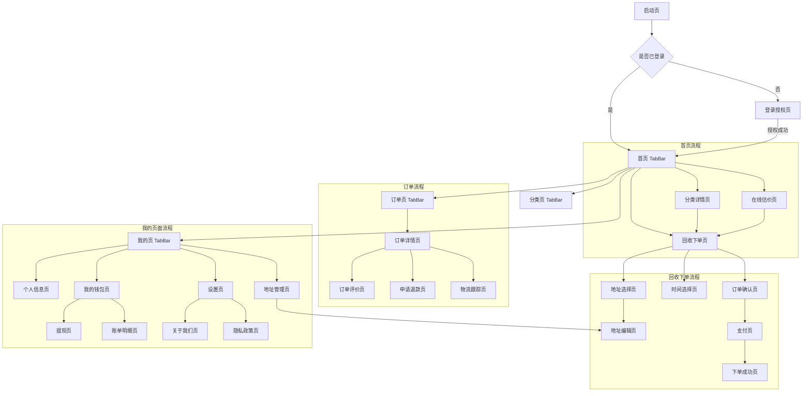

# OneRecycle 小程序原型设计文档

## 1. 页面导航结构



## 2. 页面详细设计

### 2.1 启动页 (Splash)

**路径**: `pages/splash/index`

**功能**: 应用启动加载页，展示品牌Logo和Slogan

**UI元素**:

- 居中Logo (200x200px)
- Slogan: "让旧物重获新生"
- 加载动画

**跳转逻辑**:

- 检查登录状态 → 已登录跳转首页，未登录跳转登录页

---

### 2.2 登录授权页 (Login)

**路径**: `pages/login/index`

**功能**: 用户授权登录，获取用户信息

**UI元素**:

```
┌─────────────────────────┐
│   [OneRecycle Logo]     │
│                         │
│   让旧物重获新生         │
│                         │
│   [环保插图]            │
│                         │
│   • 快速上门回收        │
│   • 价格透明公道        │
│   • 环保公益事业        │
│                         │
│  [微信授权登录按钮]     │
│  [支付宝授权登录按钮]   │
│                         │
│  [同意《用户协议》]     │
└─────────────────────────┘
```

**交互**:

- 点击授权按钮 → 调用平台授权API → 成功后跳转首页
- 首次登录自动创建账户

**跳转**: `navigateTo('/pages/index/index')`

---

### 2.3 首页 (Home) - TabBar

**路径**: `pages/index/index`

**功能**: 展示核心功能入口、分类导航、活动推广

**UI布局**:

```
┌─────────────────────────────────┐
│ [Logo] 深圳 ▼    [搜索] [消息]  │ ← 顶部导航
├─────────────────────────────────┤
│  [轮播Banner - 活动推广]        │
├─────────────────────────────────┤
│  ┌──────────────────────────┐  │
│  │ 🎯 一键预约回收           │  │ ← 主要CTA
│  │ 上门取件 · 价格透明       │  │
│  └──────────────────────────┘  │
├─────────────────────────────────┤
│  热门分类                       │
│  ┌────┐ ┌────┐ ┌────┐ ┌────┐ │
│  │👕 │ │📱 │ │📚 │ │💍 │ │
│  │衣物│ │数码│ │书籍│ │黄金│ │
│  └────┘ └────┘ └────┘ └────┘ │
│  ┌────┐ ┌────┐ ┌────┐ ┌────┐ │
│  │🪑 │ │🔌 │ │🎮 │ │➕ │ │
│  │家具│ │电器│ │玩具│ │更多│ │
│  └────┘ └────┘ └────┘ └────┘ │
├─────────────────────────────────┤
│  快速估价                       │
│  ┌──────────────────────────┐  │
│  │ 我的宝贝值多少钱？        │  │
│  │ [添加物品] [立即估价]     │  │
│  └──────────────────────────┘  │
├─────────────────────────────────┤
│  环保资讯                       │
│  [卡片1: 旧衣回收知识]          │
│  [卡片2: 电子垃圾危害]          │
└─────────────────────────────────┘
│ [首页] [分类] [订单] [我的]    │ ← TabBar
└─────────────────────────────────┘
```

**交互**:

- 点击"一键预约回收" → `navigateTo('/pages/recycle/form')`
- 点击分类图标 → `navigateTo('/pages/category/detail?id=xxx')`
- 点击"立即估价" → `navigateTo('/pages/pricing/index')`
- 点击搜索 → `navigateTo('/pages/search/index')`

---

### 2.4 分类详情页 (Category Detail)

**路径**: `pages/category/detail`

**参数**: `id` (分类ID)

**功能**: 展示某个分类下的详细信息和可回收物品

**UI布局**:

```
┌─────────────────────────────────┐
│ ← 返回    手机数码回收           │
├─────────────────────────────────┤
│  [分类封面图]                   │
│  回收价格: ¥50-500/台           │
│  已回收: 12,345 台              │
├─────────────────────────────────┤
│  回收流程                       │
│  ① 提交订单 → ② 上门取件 →     │
│  ③ 专业评估 → ④ 确认收款       │
├─────────────────────────────────┤
│  热门机型                       │
│  ┌─────────────────────────┐   │
│  │ [图] iPhone 13 Pro      │   │
│  │      ¥800-1500          │   │
│  │      [立即回收]         │   │
│  └─────────────────────────┘   │
│  ┌─────────────────────────┐   │
│  │ [图] 华为 Mate 40       │   │
│  │      ¥600-1200          │   │
│  │      [立即回收]         │   │
│  └─────────────────────────┘   │
├─────────────────────────────────┤
│  [立即预约回收]                 │
└─────────────────────────────────┘
```

**交互**:

- 点击"立即回收" → `navigateTo('/pages/recycle/form?categoryId=xxx&itemId=xxx')`
- 点击"立即预约回收" → `navigateTo('/pages/recycle/form?categoryId=xxx')`

---

### 2.5 在线估价页 (Pricing)

**路径**: `pages/pricing/index`

**功能**: 用户添加多个物品进行价格估算

**UI布局**:

```
┌─────────────────────────────────┐
│ ← 返回    在线估价               │
├─────────────────────────────────┤
│  已添加物品 (2)                 │
│  ┌─────────────────────────┐   │
│  │ 👕 普通衣物              │   │
│  │    预估: 5kg             │   │
│  │    约 ¥10-15            │   │
│  │                    [删除]│   │
│  └─────────────────────────┘   │
│  ┌─────────────────────────┐   │
│  │ 📱 iPhone 12             │   │
│  │    成色: 良好            │   │
│  │    约 ¥600-800          │   │
│  │                    [删除]│   │
│  └─────────────────────────┘   │
│                                 │
│  [+ 继续添加物品]               │
├─────────────────────────────────┤
│  预估总价                       │
│  ¥610 - ¥815                   │
│                                 │
│  * 实际价格以上门评估为准       │
├─────────────────────────────────┤
│  [立即预约回收]                 │
└─────────────────────────────────┘
```

**交互**:

- 点击"添加物品" → 弹出分类选择器
- 点击"立即预约回收" → `navigateTo('/pages/recycle/form')` 并携带估价数据

---

### 2.6 回收下单页 (Recycle Form)

**路径**: `pages/recycle/form`

**功能**: 填写回收物品信息、选择地址和时间

**UI布局**:

```
┌─────────────────────────────────┐
│ ← 返回    填写回收信息           │
├─────────────────────────────────┤
│  收货地址                       │
│  ┌─────────────────────────┐   │
│  │ 📍 张三 138****1234      │   │
│  │    广东省深圳市南山区... │   │
│  │                    修改 >│   │
│  └─────────────────────────┘   │
├─────────────────────────────────┤
│  回收物品                       │
│  ┌─────────────────────────┐   │
│  │ 物品1: 手机数码          │   │
│  │ [选择分类 >]             │   │
│  │                          │   │
│  │ 物品照片 (最多6张)       │   │
│  │ [+] [+] [+]              │   │
│  │                          │   │
│  │ 品牌型号                 │   │
│  │ [输入框: iPhone 13 Pro]  │   │
│  │                          │   │
│  │ 物品成色                 │   │
│  │ ○ 全新 ● 良好 ○ 一般    │   │
│  │                          │   │
│  │ 预估重量/数量            │   │
│  │ [输入框: 1] 台           │   │
│  │                          │   │
│  │ 备注说明                 │   │
│  │ [输入框: 屏幕有划痕]     │   │
│  │                    [删除]│   │
│  └─────────────────────────┘   │
│  [+ 添加更多物品]               │
├─────────────────────────────────┤
│  上门时间                       │
│  ┌─────────────────────────┐   │
│  │ 🕐 2025-11-22 14:00-16:00│   │
│  │                    选择 >│   │
│  └─────────────────────────┘   │
├─────────────────────────────────┤
│  预估金额: ¥115.00              │
│  (实际价格以上门评估为准)       │
├─────────────────────────────────┤
│  [下一步: 确认订单]             │
└─────────────────────────────────┘
```

**交互**:

- 点击"修改地址" → `navigateTo('/pages/address/list?from=recycle')`
- 点击"选择分类" → 弹出分类选择器
- 点击"选择时间" → `navigateTo('/pages/recycle/time-picker')`
- 点击"下一步" → `navigateTo('/pages/recycle/confirm')`

---

### 2.7 地址选择页 (Address List)

**路径**: `pages/address/list`

**参数**: `from` (来源页面标识)

**功能**: 选择或管理收货地址

**UI布局**:

```
┌─────────────────────────────────┐
│ ← 返回    选择地址        [新增] │
├─────────────────────────────────┤
│  ┌─────────────────────────┐   │
│  │ ● 张三  138****1234      │   │
│  │   广东省深圳市南山区     │   │
│  │   科技园南区深南大道...  │   │
│  │   [默认]          [编辑] │   │
│  └─────────────────────────┘   │
│  ┌─────────────────────────┐   │
│  │ ○ 李四  139****5678      │   │
│  │   广东省深圳市福田区     │   │
│  │   华强北路...            │   │
│  │                   [编辑] │   │
│  └─────────────────────────┘   │
│                                 │
│  [+ 新增收货地址]               │
└─────────────────────────────────┘
```

**交互**:

- 点击地址卡片 → 选中并返回上一页
- 点击"编辑" → `navigateTo('/pages/address/edit?id=xxx')`
- 点击"新增" → `navigateTo('/pages/address/edit')`

---

### 2.8 地址编辑页 (Address Edit)

**路径**: `pages/address/edit`

**参数**: `id` (地址ID，新增时为空)

**UI布局**:

```
┌─────────────────────────────────┐
│ ← 返回    编辑地址               │
├─────────────────────────────────┤
│  收货人                         │
│  [输入框: 张三]                 │
│                                 │
│  手机号码                       │
│  [输入框: 13812341234]          │
│                                 │
│  所在地区                       │
│  [选择器: 广东省 深圳市 南山区] │
│                                 │
│  详细地址                       │
│  [文本域: 科技园南区...]        │
│                                 │
│  地址标签                       │
│  ○ 家  ● 公司  ○ 学校  ○ 其他 │
│                                 │
│  [✓] 设为默认地址               │
├─────────────────────────────────┤
│  [保存]                [删除]   │
└─────────────────────────────────┘
```

**交互**:

- 点击"保存" → 提交数据 → 返回地址列表
- 点击"删除" → 确认弹窗 → 删除并返回

---

### 2.9 时间选择页 (Time Picker)

**路径**: `pages/recycle/time-picker`

**功能**: 选择上门回收时间

**UI布局**:

```
┌─────────────────────────────────┐
│ ← 返回    选择上门时间           │
├─────────────────────────────────┤
│  选择日期                       │
│  ┌────┐ ┌────┐ ┌────┐ ┌────┐  │
│  │今天│ │明天│ │后天│ │11/25│ │
│  │满 │ │● │ │  │ │  │  │
│  └────┘ └────┘ └────┘ └────┘  │
│                                 │
│  选择时段                       │
│  ┌─────────────────────────┐   │
│  │ ○ 08:00 - 10:00  (已满) │   │
│  └─────────────────────────┘   │
│  ┌─────────────────────────┐   │
│  │ ○ 10:00 - 12:00         │   │
│  └─────────────────────────┘   │
│  ┌─────────────────────────┐   │
│  │ ● 14:00 - 16:00         │   │
│  └─────────────────────────┘   │
│  ┌─────────────────────────┐   │
│  │ ○ 16:00 - 18:00         │   │
│  └─────────────────────────┘   │
│  ┌─────────────────────────┐   │
│  │ ○ 18:00 - 20:00         │   │
│  └─────────────────────────┘   │
├─────────────────────────────────┤
│  [确认选择]                     │
└─────────────────────────────────┘
```

**交互**:

- 选择日期和时段 → 点击"确认" → 返回下单页并更新时间

---

### 2.10 订单确认页 (Order Confirm)

**路径**: `pages/recycle/confirm`

**功能**: 确认订单信息并提交

**UI布局**:

```
┌─────────────────────────────────┐
│ ← 返回    确认订单               │
├─────────────────────────────────┤
│  收货信息                       │
│  张三  138****1234              │
│  广东省深圳市南山区科技园...    │
├─────────────────────────────────┤
│  上门时间                       │
│  2025-11-22 (周五) 14:00-16:00 │
├─────────────────────────────────┤
│  回收物品                       │
│  ┌─────────────────────────┐   │
│  │ [图] iPhone 13 Pro      │   │
│  │      良好 · 1台         │   │
│  │      ¥800               │   │
│  └─────────────────────────┘   │
│  ┌─────────────────────────┐   │
│  │ [图] 普通衣物            │   │
│  │      5kg                │   │
│  │      ¥15                │   │
│  └─────────────────────────┘   │
├─────────────────────────────────┤
│  费用明细                       │
│  回收预估金额        + ¥815.00  │
│  上门服务费          -  ¥5.00   │
│  ─────────────────────────────  │
│  预估收款            ¥810.00    │
│  (实际金额以上门评估为准)       │
├─────────────────────────────────┤
│  订单备注                       │
│  [输入框: 请在14:30后到达]      │
├─────────────────────────────────┤
│  [✓] 我已阅读并同意             │
│      《回收服务协议》           │
├─────────────────────────────────┤
│  [提交订单]                     │
└─────────────────────────────────┘
```

**交互**:

- 点击"提交订单" → 创建订单 → `redirectTo('/pages/order/success?orderNo=xxx')`

---

### 2.11 下单成功页 (Order Success)

**路径**: `pages/order/success`

**参数**: `orderNo` (订单号)

**UI布局**:

```
┌─────────────────────────────────┐
│                                 │
│         ✓                       │
│     订单提交成功                │
│                                 │
│  订单号: 202511220001           │
│  预约时间: 11-22 14:00-16:00    │
│                                 │
│  我们将尽快为您安排快递员       │
│  请保持手机畅通                 │
│                                 │
│  [查看订单详情]                 │
│  [返回首页]                     │
│                                 │
└─────────────────────────────────┘
```

**交互**:

- 点击"查看订单详情" → `redirectTo('/pages/order/detail?id=xxx')`
- 点击"返回首页" → `switchTab('/pages/index/index')`

---

### 2.12 订单列表页 (Order List) - TabBar

**路径**: `pages/order/list`

**功能**: 展示用户所有订单，支持筛选

**UI布局**:

```
┌─────────────────────────────────┐
│         我的订单                 │
├─────────────────────────────────┤
│ [全部] [待接单] [待上门] [已完成]│
├─────────────────────────────────┤
│  ┌─────────────────────────┐   │
│  │ 订单号: 202511220001     │   │
│  │ 状态: 待上门  2025-11-22 │   │
│  │ ─────────────────────── │   │
│  │ [图] iPhone 13 Pro      │   │
│  │      普通衣物 5kg       │   │
│  │ ─────────────────────── │   │
│  │ 预估金额: ¥810.00       │   │
│  │                         │   │
│  │ [取消订单] [查看详情]   │   │
│  └─────────────────────────┘   │
│  ┌─────────────────────────┐   │
│  │ 订单号: 202511200002     │   │
│  │ 状态: 已完成  2025-11-20 │   │
│  │ ─────────────────────── │   │
│  │ [图] 旧书籍 10kg        │   │
│  │ ─────────────────────── │   │
│  │ 实际金额: ¥25.00        │   │
│  │                         │   │
│  │ [评价] [查看详情]       │   │
│  └─────────────────────────┘   │
└─────────────────────────────────┘
│ [首页] [分类] [订单] [我的]    │
└─────────────────────────────────┘
```

**交互**:

- 点击Tab切换订单状态筛选
- 点击"查看详情" → `navigateTo('/pages/order/detail?id=xxx')`
- 点击"取消订单" → 确认弹窗 → 取消订单
- 点击"评价" → `navigateTo('/pages/order/review?id=xxx')`

---

### 2.13 订单详情页 (Order Detail)

**路径**: `pages/order/detail`

**参数**: `id` (订单ID)

**功能**: 查看订单详细信息和状态

**UI布局**:

```
┌─────────────────────────────────┐
│ ← 返回    订单详情               │
├─────────────────────────────────┤
│  ┌─────────────────────────┐   │
│  │   🚚 快递员正在路上      │   │
│  │   预计 14:30 到达        │   │
│  └─────────────────────────┘   │
├─────────────────────────────────┤
│  快递员信息                     │
│  ┌─────────────────────────┐   │
│  │ [头像] 李师傅            │   │
│  │        ⭐ 4.9 (328单)   │   │
│  │        📞 [拨打电话]     │   │
│  └─────────────────────────┘   │
├─────────────────────────────────┤
│  订单进度                       │
│  ● 订单已提交                   │
│    2025-11-22 12:30             │
│                                 │
│  ● 快递员已接单                 │
│    2025-11-22 12:35             │
│    李师傅已接单，正在赶往       │
│                                 │
│  ◐ 快递员上门中                 │
│    预计 14:30 到达              │
│                                 │
│  ○ 回收完成                     │
│                                 │
│  ○ 结算完成                     │
├─────────────────────────────────┤
│  订单信息                       │
│  订单号: 202511220001           │
│  下单时间: 2025-11-22 12:30     │
│                                 │
│  收货地址                       │
│  张三  138****1234              │
│  广东省深圳市南山区...          │
│                                 │
│  预约时间                       │
│  2025-11-22 14:00-16:00         │
│                                 │
│  回收物品                       │
│  ┌─────────────────────────┐   │
│  │ [图] iPhone 13 Pro      │   │
│  │      良好 · 1台         │   │
│  │      预估 ¥800          │   │
│  └─────────────────────────┘   │
│  ┌─────────────────────────┐   │
│  │ [图] 普通衣物            │   │
│  │      5kg                │   │
│  │      预估 ¥15           │   │
│  └─────────────────────────┘   │
│                                 │
│  费用明细                       │
│  回收预估金额        + ¥815.00  │
│  上门服务费          -  ¥5.00   │
│  ─────────────────────────────  │
│  预估收款            ¥810.00    │
├─────────────────────────────────┤
│  [取消订单]  [联系客服]         │
└─────────────────────────────────┘
```

**状态变化**:

- **待接单**: 显示"取消订单"按钮
- **待上门**: 显示快递员信息、"取消订单"、"联系客服"
- **回收中**: 显示实时进度、"联系客服"
- **已完成**: 显示实际金额、"评价"、"再次回收"
- **已取消**: 显示取消原因

**交互**:

- 点击"拨打电话" → 调用系统拨号
- 点击"取消订单" → 确认弹窗 → 取消
- 点击"联系客服" → 跳转客服页面

---

### 2.14 订单评价页 (Order Review)

**路径**: `pages/order/review`

**参数**: `id` (订单ID)

**UI布局**:

```
┌─────────────────────────────────┐
│ ← 返回    评价订单               │
├─────────────────────────────────┤
│  快递员服务                     │
│  ⭐ ⭐ ⭐ ⭐ ⭐                  │
│                                 │
│  服务态度                       │
│  ⭐ ⭐ ⭐ ⭐ ⭐                  │
│                                 │
│  价格满意度                     │
│  ⭐ ⭐ ⭐ ⭐ ⭐                  │
│                                 │
│  评价内容                       │
│  ┌─────────────────────────┐   │
│  │ [文本域: 请输入评价...]  │   │
│  │                         │   │
│  │                         │   │
│  └─────────────────────────┘   │
│                                 │
│  上传照片 (选填)                │
│  [+] [+] [+]                    │
│                                 │
│  [✓] 匿名评价                   │
├─────────────────────────────────┤
│  [提交评价]                     │
└─────────────────────────────────┘
```

**交互**:

- 点击星星评分
- 点击"提交评价" → 提交 → 返回订单详情

---

### 2.15 分类页 (Category) - TabBar

**路径**: `pages/category/index`

**功能**: 展示所有回收分类

**UI布局**:

```
┌─────────────────────────────────┐
│         回收分类          [搜索] │
├─────────────────────────────────┤
│  热门分类                       │
│  ┌─────────────────────────┐   │
│  │ [图] 手机数码            │   │
│  │      ¥50-500/台         │   │
│  │      已回收 12,345 台   │   │
│  └─────────────────────────┘   │
│  ┌─────────────────────────┐   │
│  │ [图] 品牌衣物            │   │
│  │      ¥5-50/kg           │   │
│  │      已回收 234,567 kg  │   │
│  └─────────────────────────┘   │
│  ┌─────────────────────────┐   │
│  │ [图] 黄金首饰            │   │
│  │      ¥350-400/g         │   │
│  │      已回收 1,234 g     │   │
│  └─────────────────────────┘   │
│                                 │
│  全部分类                       │
│  ┌────┐ ┌────┐ ┌────┐ ┌────┐  │
│  │👕 │ │📱 │ │📚 │ │💍 │  │
│  │衣物│ │数码│ │书籍│ │黄金│  │
│  └────┘ └────┘ └────┘ └────┘  │
│  ┌────┐ ┌────┐ ┌────┐ ┌────┐  │
│  │🪑 │ │🔌 │ │🎮 │ │🧸 │  │
│  │家具│ │电器│ │玩具│ │其他│  │
│  └────┘ └────┘ └────┘ └────┘  │
└─────────────────────────────────┘
│ [首页] [分类] [订单] [我的]    │
└─────────────────────────────────┘
```

**交互**:

- 点击分类卡片 → `navigateTo('/pages/category/detail?id=xxx')`
- 点击搜索 → `navigateTo('/pages/search/index')`

---

### 2.16 我的页 (Profile) - TabBar

**路径**: `pages/profile/index`

**功能**: 个人中心，展示用户信息和功能入口

**UI布局**:

```
┌─────────────────────────────────┐
│         我的                     │
├─────────────────────────────────┤
│  ┌─────────────────────────┐   │
│  │ [头像] 张三              │   │
│  │        138****1234       │   │
│  │        [编辑资料 >]      │   │
│  └─────────────────────────┘   │
├─────────────────────────────────┤
│  ┌─────────────────────────┐   │
│  │ 💰 我的钱包              │   │
│  │    余额: ¥1,234.56      │   │
│  │    [提现] [明细]        │   │
│  └─────────────────────────┘   │
├─────────────────────────────────┤
│  我的服务                       │
│  ┌────┐ ┌────┐ ┌────┐ ┌────┐  │
│  │📦 │ │📍 │ │⭐ │ │🎫 │  │
│  │订单│ │地址│ │评价│ │优惠│  │
│  └────┘ └────┘ └────┘ └────┘  │
├─────────────────────────────────┤
│  环保贡献                       │
│  ┌─────────────────────────┐   │
│  │ 🌱 已回收 15 次          │   │
│  │ 🌍 减少碳排放 23.5 kg   │   │
│  │ 🏆 环保达人勋章          │   │
│  └─────────────────────────┘   │
├─────────────────────────────────┤
│  其他功能                       │
│  [客服中心 >]                   │
│  [常见问题 >]                   │
│  [关于我们 >]                   │
│  [设置 >]                       │
└─────────────────────────────────┘
│ [首页] [分类] [订单] [我的]    │
└─────────────────────────────────┘
```

**交互**:

- 点击"编辑资料" → `navigateTo('/pages/profile/edit')`
- 点击"我的钱包" → `navigateTo('/pages/wallet/index')`
- 点击"提现" → `navigateTo('/pages/wallet/withdraw')`
- 点击"明细" → `navigateTo('/pages/wallet/transactions')`
- 点击"地址" → `navigateTo('/pages/address/list')`
- 点击"设置" → `navigateTo('/pages/settings/index')`

---

### 2.17 我的钱包页 (Wallet)

**路径**: `pages/wallet/index`

**功能**: 查看账户余额和交易记录

**UI布局**:

```
┌─────────────────────────────────┐
│ ← 返回    我的钱包               │
├─────────────────────────────────┤
│  ┌─────────────────────────┐   │
│  │ 账户余额 (元)            │   │
│  │ 1,234.56                │   │
│  │                         │   │
│  │ 冻结金额: ¥0.00         │   │
│  │ 累计收入: ¥5,678.90     │   │
│  └─────────────────────────┘   │
│                                 │
│  [提现]  [充值]                 │
├─────────────────────────────────┤
│  账单明细                       │
│  ┌─────────────────────────┐   │
│  │ 订单收入                 │   │
│  │ 2025-11-20 15:30        │   │
│  │ 订单号: 202511200002     │   │
│  │                 + ¥25.00│   │
│  └─────────────────────────┘   │
│  ┌─────────────────────────┐   │
│  │ 提现                     │   │
│  │ 2025-11-18 10:20        │   │
│  │ 提现到微信零钱           │   │
│  │                 - ¥500.00│   │
│  └─────────────────────────┘   │
│  ┌─────────────────────────┐   │
│  │ 订单收入                 │   │
│  │ 2025-11-15 14:00        │   │
│  │ 订单号: 202511150001     │   │
│  │                 + ¥810.00│   │
│  └─────────────────────────┘   │
│                                 │
│  [查看更多 >]                   │
└─────────────────────────────────┘
```

**交互**:

- 点击"提现" → `navigateTo('/pages/wallet/withdraw')`
- 点击"查看更多" → `navigateTo('/pages/wallet/transactions')`

---

### 2.18 提现页 (Withdraw)

**路径**: `pages/wallet/withdraw`

**功能**: 申请提现到微信/支付宝/银行卡

**UI布局**:

```
┌─────────────────────────────────┐
│ ← 返回    提现                   │
├─────────────────────────────────┤
│  可提现余额                     │
│  ¥ 1,234.56                     │
├─────────────────────────────────┤
│  提现金额                       │
│  ¥ [输入框]                     │
│  [全部提现]                     │
│                                 │
│  手续费: ¥0.00                  │
│  实际到账: ¥0.00                │
├─────────────────────────────────┤
│  提现方式                       │
│  ● 微信零钱                     │
│     张三 (微信绑定账号)         │
│                                 │
│  ○ 支付宝                       │
│     [绑定支付宝账号 >]          │
│                                 │
│  ○ 银行卡                       │
│     [添加银行卡 >]              │
├─────────────────────────────────┤
│  提现说明                       │
│  • 单笔最低提现金额 ¥10         │
│  • 每日最多提现 3 次            │
│  • 预计 1-3 个工作日到账        │
├─────────────────────────────────┤
│  [确认提现]                     │
└─────────────────────────────────┘
```

**交互**:

- 输入金额 → 自动计算手续费和到账金额
- 点击"全部提现" → 填充可提现余额
- 选择提现方式
- 点击"确认提现" → 验证 → 提交 → 跳转提现结果页

---

### 2.19 账单明细页 (Transactions)

**路径**: `pages/wallet/transactions`

**功能**: 查看所有账户流水

**UI布局**:

```
┌─────────────────────────────────┐
│ ← 返回    账单明细               │
├─────────────────────────────────┤
│  [全部] [收入] [支出]           │
├─────────────────────────────────┤
│  2025年11月                     │
│  ┌─────────────────────────┐   │
│  │ 订单收入                 │   │
│  │ 11-20 15:30             │   │
│  │ 订单号: 202511200002     │   │
│  │                 + ¥25.00│   │
│  └─────────────────────────┘   │
│  ┌─────────────────────────┐   │
│  │ 提现                     │   │
│  │ 11-18 10:20             │   │
│  │ 微信零钱                 │   │
│  │                 - ¥500.00│   │
│  └─────────────────────────┘   │
│  ┌─────────────────────────┐   │
│  │ 订单收入                 │   │
│  │ 11-15 14:00             │   │
│  │ 订单号: 202511150001     │   │
│  │                 + ¥810.00│   │
│  └─────────────────────────┘   │
│                                 │
│  2025年10月                     │
│  ┌─────────────────────────┐   │
│  │ 订单收入                 │   │
│  │ 10-28 16:45             │   │
│  │ 订单号: 202510280003     │   │
│  │                 + ¥156.00│   │
│  └─────────────────────────┘   │
└─────────────────────────────────┘
```

**交互**:

- 点击Tab筛选交易类型
- 下拉刷新、上拉加载更多
- 点击交易记录 → 查看详情

---

### 2.20 设置页 (Settings)

**路径**: `pages/settings/index`

**功能**: 系统设置和账户管理

**UI布局**:

```
┌─────────────────────────────────┐
│ ← 返回    设置                   │
├─────────────────────────────────┤
│  账户设置                       │
│  [修改手机号 >]                 │
│  [实名认证 >]                   │
│  [账号安全 >]                   │
├─────────────────────────────────┤
│  通知设置                       │
│  [消息通知 >]                   │
│  [订单提醒 >]                   │
├─────────────────────────────────┤
│  其他设置                       │
│  [清理缓存 >]                   │
│  [隐私政策 >]                   │
│  [用户协议 >]                   │
│  [关于我们 >]                   │
│  [检查更新 >]                   │
├─────────────────────────────────┤
│  当前版本: v1.0.0               │
├─────────────────────────────────┤
│  [退出登录]                     │
└─────────────────────────────────┘
```

**交互**:

- 点击各项进入对应设置页
- 点击"退出登录" → 确认弹窗 → 清除登录状态 → 跳转登录页

---

## 3. 页面路由配置

### 3.1 TabBar 页面

```javascript
// app.config.ts
export default {
  pages: [
    "pages/index/index",
    "pages/category/index",
    "pages/order/list",
    "pages/profile/index",
    // ... 其他页面
  ],
  tabBar: {
    color: "#636E72",
    selectedColor: "#00B894",
    backgroundColor: "#FFFFFF",
    borderStyle: "black",
    list: [
      {
        pagePath: "pages/index/index",
        text: "首页",
        iconPath: "assets/icons/home.png",
        selectedIconPath: "assets/icons/home-active.png",
      },
      {
        pagePath: "pages/category/index",
        text: "分类",
        iconPath: "assets/icons/category.png",
        selectedIconPath: "assets/icons/category-active.png",
      },
      {
        pagePath: "pages/order/list",
        text: "订单",
        iconPath: "assets/icons/order.png",
        selectedIconPath: "assets/icons/order-active.png",
      },
      {
        pagePath: "pages/profile/index",
        text: "我的",
        iconPath: "assets/icons/profile.png",
        selectedIconPath: "assets/icons/profile-active.png",
      },
    ],
  },
};
```

### 3.2 页面跳转方式

| 跳转方式       | 使用场景                 | 示例                   |
| -------------- | ------------------------ | ---------------------- |
| `navigateTo`   | 普通页面跳转，保留当前页 | 详情页、表单页         |
| `redirectTo`   | 重定向，不保留当前页     | 登录后跳转、提交成功页 |
| `switchTab`    | 跳转到TabBar页面         | 返回首页               |
| `navigateBack` | 返回上一页               | 返回按钮               |
| `reLaunch`     | 关闭所有页面，打开新页面 | 退出登录               |

---

## 4. 交互规范

### 4.1 加载状态

- 页面加载: 显示骨架屏或加载动画
- 按钮点击: 显示loading状态，防止重复提交
- 列表加载: 下拉刷新、上拉加载更多

### 4.2 错误处理

- 网络错误: 显示错误提示，提供重试按钮
- 表单验证: 实时验证，错误提示在输入框下方
- 操作失败: Toast提示具体错误信息

### 4.3 确认操作

- 删除操作: 弹窗二次确认
- 取消订单: 弹窗确认并说明后果
- 退出登录: 弹窗确认

### 4.4 反馈提示

- 成功操作: Toast提示 "操作成功"
- 复制文本: Toast提示 "已复制"
- 保存成功: Toast提示 "保存成功"

---

## 5. 组件复用

### 5.1 通用组件

- `AddressCard`: 地址卡片
- `OrderCard`: 订单卡片
- `CategoryCard`: 分类卡片
- `ItemCard`: 物品卡片
- `Timeline`: 时间轴组件
- `ImageUploader`: 图片上传组件
- `DateTimePicker`: 日期时间选择器

### 5.2 业务组件

- `OrderStatus`: 订单状态展示
- `PriceEstimate`: 价格估算组件
- `CourierInfo`: 快递员信息卡片
- `WalletBalance`: 钱包余额展示

---

## 6. 数据流转

### 6.1 下单流程数据

```
首页 → 分类详情 → 回收下单
  ↓
选择地址 ← → 地址管理
  ↓
选择时间
  ↓
订单确认 (汇总所有数据)
  ↓
提交订单 (API调用)
  ↓
下单成功
```

### 6.2 状态管理

- 用户信息: 全局状态 (Context/Redux)
- 订单数据: 页面级状态
- 表单数据: 组件级状态
- 缓存数据: 本地存储 (Storage)

---

## 7. 性能优化

### 7.1 图片优化

- 使用WebP格式
- 图片懒加载
- 缩略图预览
- CDN加速

### 7.2 列表优化

- 虚拟列表 (长列表)
- 分页加载
- 数据缓存

### 7.3 包体积优化

- 按需加载
- 分包加载
- 代码压缩

---

**文档版本**: v1.0  
**最后更新**: 2025-11-21  
**维护人员**: OneRecycle 开发团队
